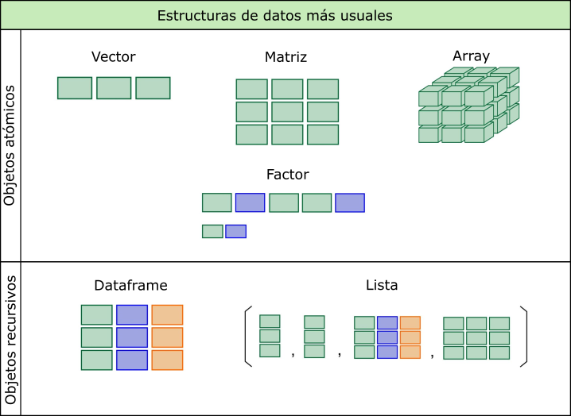

```{r, message=FALSE, echo=F}
knitr::opts_chunk$set(comment=NA, dpi = 300)
```


## Qué es el lenguaje R?

El sitio oficial [r-project.org](https://www.r-project.org/) dice que *"R es un entorno de software libre para gráficos y computación estadística. Se compila y se ejecuta en una amplia variedad de plataformas UNIX, Windows y MacOS.”.* 

Profundizando en su descripción podemos decir, más técnicamente, que es un __*lenguaje de programación interpretado, orientado a objetos, multiplataforma y open source aplicado al manejo de datos estadísticos.*__

A continuación detallamos cada parte de la definición:

**R es un lenguaje de programación estadístico**

R es un lenguaje de programación, con sus estructuras y reglas de sintaxis, que posee una gran variedad de funciones desarrolladas con fines estadísticos.

**R es un lenguaje Orientado a Objetos**

Implementa conceptos de la programación orientada a objetos y esto
le permite ser simple y flexible en el manejo de datos. En R
todo con lo que trabajamos es considerado un "objeto": las variables, funciones, datos, resultados, etc. que pueden ser modificados por otros objetos.

**R es un lenguaje interpretado**

No es necesario compilar los scripts de programación para construir
ejecutables sino que directamente se ejecutan por medio del intérprete que  devuelve resultados de forma inmediata.

**R es multiplataforma (corre en Linux, Windows y Mac)**

Funciona en diferentes sistemas operativos como Linux, Windows y Mac. 

**R es Open Source y se distribuye bajo licencia GNU - GPL**

Esto quiere decir que se distribuye gratuitamente bajo licencia GNU
(General Public License) -- GPL y que los usuarios tienen la libertad de
usar, estudiar, compartir (copiar) y modificar el software.

## Breve historia 

R fue desarrollado a partir del lenguaje S que tiene sus orígenes en Bell Labs de la AT&T (actualmente Lucent Technologies) de mediados de la década del '70. Posteriormente, S fue vendido y dio origen a una versión propietaria denominada S-Plus que es comercializada por Insighful Corporation.

En 1995 dos profesores de estadística de la Universidad de Auckland, en
Nueva Zelanda [Ross Ihaka](https://en.wikipedia.org/wiki/Ross_Ihaka) y [Robert Gentleman](https://en.wikipedia.org/wiki/Robert_Gentleman_(statistician)), iniciaron el ["Proyecto
R"](https://en.wikipedia.org/wiki/R_(programming_language)), con la intención de desarrollar un programa estadístico inspirado en el lenguaje S pero de dominio público.

Aunque se dice que R es un dialecto de S existen diferencias importantes
en el diseño de ambos lenguajes.

El software está desarrollado en lenguaje C++ con algunas rutinas
agregadas en Fortran) y su nombre se debe a la letra con la que inician
los nombres de pila de sus autores (Ross y Robert).

Actualmente es mantenido por un grupo internacional de desarrolladores
voluntarios denominado [Core Development Team](https://www.r-project.org/contributors.html).

## Scripts

Un script es un archivo de texto plano con una lista secuencial de
funciones y comandos del lenguaje R para ser ejecutado por el intérprete
de R.

Script se puede traducir como guión, archivo de órdenes, archivo de
procesamiento por lotes o archivo de sintaxis.

Generalmente se crea en editores especiales y/o en cualquier procesador básico de texto plano. Se almacena en un archivo que puede ser leído,
modificado, guardado y se puede ejecutar completo o línea a línea.

Poseen una cualidad muy provechosa: son re-utilizables, adaptándolos a
otras necesidades.

**Documentación de los scripts de R:**

La documentación es una tarea de mucha importancia en cualquier lenguaje
de programación, ya que nos permite entender que estamos haciendo en el
script. Además nos sirve para el futuro mantenimiento o para la
reutilización del código elaborado, tanto para otros usuarios como para
nosotros mismos.

La forma de documentar los scripts de código en R es utilizando
comentarios. Toda línea que comienza con el símbolo `#` es entendido por
el interprete como un comentario y los caracteres que sigan a ese
símbolo no seran tenidos en cuenta cuando se ejecute ese código.

```{r}
# esto es una línea de comentario y no es tenida en cuenta por el intérprete
```

Así que a la hora de documentar es preferible abusar de estos
comentarios que no utilizarlos.

**Generalidades del código:**

El código que se escribe del lenguaje R posee una sintaxis textual y como cualquier lenguaje de programación es precisa.

La exactitud en la escritura de comandos y funciones incluye la
distinción entre mayúsculas y minúsculas. Es decir, que no es lo mismo una 'a' que una 'A'.


## Funciones

Los comandos u órdenes elementales de R se denominan funciones. A algunas se las llama "integradas" porque están incluidas en el núcleo (R base) y sus nombres están reservados.

Tambien podemos utilizar otras pertenecientes a librerías (paquetes) que se pueden instalar.

Toda función tiene un nombre y normalmente recibe argumentos o
parámetros que deben ser escritos **entre paréntesis y separados por comas**. Incluso algunas de ellas que no tienen asociado ningún argumento necesitan finalizar con paréntesis `()` para ser entendidas como funciones.

Siempre una función devuelve un resultado, un valor o realiza una
acción.

```{r,echo=F,  fig.align='center', out.width = "50%"}
knitr::include_graphics("funciones.jpg")
```


## Librerías (paquetes)

Las librerías son grupos de funciones empaquetados que se pueden
instalar y utilizar en el análisis de datos. Habitualmente se agrupan
por tema o similitud de funciones.

Estos paquetes se pueden descargar directamente del repositorio oficial
de CRAN en Internet (similar al uso de los repositorios de Linux) o bien
descargar en formato .zip para luego instalar y usar.

Se pueden activar y desactivar en cualquier momento del análisis.

Algunos poseen dependencias de otros paquetes que serán necesarios para
que funcione.

Cualquier usuario puede crear paquetes de funciones y compartirlos,
aunque requerirá para esto de un manejo avanzado del software.

## Sintaxis, errores y advertencias

El lenguaje es muy preciso en su sintaxis y equivocarse en la forma de escribir una función o cualquier otro objeto produce respuestas de error del interprete de R que es habitual cuando iniciamos el aprendizaje.

La exactitud en la escritura de comandos y funciones incluye la
distinción entre mayúsculas y minúsculas. Es decir, que no es lo mismo una 'a' que una 'A'.

Existen tres grupos de mensajes de error:

- error de sintaxis
- error de objeto no encontrado
- otros errores

Se dice que hay un error de sintaxis, cuando ejecutamos una línea de código que el motor de R no puede interpretar debido a que algo está mal escrito.

Habitualmente los errores de sintaxis se deben a que falta o sobra algún elemento necesario en la estructura de una función (comas, parentesis, llaves, corchetes, comillas, etc.)

Por ejemplo la función `rep()` repite valores una cantidad de veces. Tiene dos argumentos, `x` donde se coloca el valor a repetir y `times` donde se define la cantidad de veces.


```{r}
rep(x = 3, times = 4) #repetimos 4 veces 3 con rep()
```

Si nos olvidamos de cerrar el paréntesis...

```{r, eval=FALSE}
rep(x = 3, times = 4
    
Error: Incomplete expression: rep(x = 3, times = 4
```
Si nos olvidamos de separar los argumentos con la coma

```{r, eval=FALSE}
rep(x =3 times = 4)

Error: unexpected symbol in "rep(x =3 times"
```
Si en lugar de escribir x como primer argumento y escribimos otra letra...


```{r, eval=FALSE}
rep(y =3, times = 4)

Error in rep(y = 3, times = 4) : 
  attempt to replicate an object of type 'symbol'
```
Si escribimos mal la función...

```{r, eval=FALSE}
REP(x =3, times = 4)

Error in REP(x = 3, times = 4) : no se pudo encontrar la función "rop"
```
Esta última posibilidad es similar a un "objeto no encontrado" por **error de sintaxis**.

Los mensajes de error en general y sobre todo al principio pueden parecer extraños y difíciles de entender, pero con un poco de práctica podemos inferir donde está el problema.

Los errores de **objetos no encontrados** pueden tener una de varias causas:

- el nombre no se escribió correctamente (p.ej.: sintaxis, mayúsculas / minúsculas)
- el paquete o archivo que contiene el objeto no ha sido cargado
- olvidamos poner comillas en un lugar que corresponde 
- otros motivos posibles

Volvamos al ejemplo anterior, ahora repitiendo un valor tipo character

```{r}
rep(x = "A", times = 4) #repetimos 4 veces 3 con rep()
```
Si olvidamos las comillas...

```{r, eval=FALSE}
rep(x = A, times = 4) #repetimos 4 veces 3 con rep()

Error: objeto 'A' no encontrado
```

**Advertencias**

Una advertencia no es algo tan serio, como un error, o al menos no lo parece, ya que esta permite que la función se ejecute igual. Pero puede ocurrir que ignorar una advertencia llegue a ser algo muy serio, si esto implica que la salida de la función es equivocada.

Por lo tanto, es una buena política entender los mensajes de advertencia para ver si indican problemas para preocuparnos o no.

Resumiendo:

```{r,echo=F,  fig.align='center', out.width = "60%"}
knitr::include_graphics("errores_advertencias.PNG")
```


## Conceptos básicos de codificación

Todas las declaraciones donde se crean objetos, tienen este símbolo de asignación `<-`. 

```{r, eval=F}
nombre_objeto <- valor
```

Veámoslo en un ejemplo:

```{r}
a <- 1
```

En este caso asignamos el valor 1 al objeto `a`. El objeto `a` es un vector de una posición (un solo valor).

Si llamasemos al objeto `a`, el interprete nos devuelve el valor
asignado previamente.

```{r}
a
```

Observemos que además de devolvernos el valor aparece delante un 1 entre corchetes `[1]`.Este número es la ubicación o índice del comienzo del objeto, que para este caso tiene una sola posición. 

## Estructuras de datos

Los objetos *contenedores de datos* más simples pertenecen a **cinco
clases** que se denominan *atómicas* y que son los siguientes tipos de
datos:

-   integer (números enteros)
-   numeric (números reales)
-   complex (números complejos)
-   chacacter (cadena de caracteres)
-   logical (lógicos o booleanos -- toman valores por si o no)

```{r,echo=F,  fig.align='center', out.width = "80%"}
knitr::include_graphics("tipo_datos.jpg")
```


Sin embargo, cada una de estas clases de datos no se encuentran de
manera aislada, sino encapsulados dentro de la clase de objeto
operacional más básica del lenguaje a la que se denomina **vector**.

**Vector**

Un vector es un conjunto de valores (números o símbolos), todos del
mismo tipo ordenados de la forma (elemento 1, elemento 2, ... , elemento
$n$) y $n$ es la longitud o tamaño del vector.

Surge de la definición dos términos importantes: el tipo y la longitud.

Todos los objetos de datos tienen estos dos atributos intrínsecos.

-   el tipo, que puede ser integer, numeric, chacacter, complex y
    logical
-   la longitud, que es el número de elementos que contiene el objeto.

El vector más simple es el que contiene un dato, podría ser numérico de
un solo dígito. El tipo sería numeric y la longitud 1.

```{r}
vec1 <- 1
vec1
```

Otro vector más grande por ejemplo podría ser (1,5,2). En este caso
también es del tipo numeric pero tiene una longitud de 3 elementos (3
posiciones que integran el vector).

```{r}
vec2 <- c(1,5,2)
vec2
```

Como vemos, para concatenar estos tres valores numéricos usamos la forma
`c()`. Esta `c` es una función de R, justamente para concatenar. (todo
lo que aparece siempre antes de paréntesis es una función). Dentro de la
función los valores van separados por comas.

Aquí podemos señalar otra característica, según la definición de vector,
la colección de elementos se encuentra ordenada, por lo que en nuestro
ejemplo la primera posición la ocupa el 1, la segunda el 5 y la tercera
el 2. Como el orden importa, si tuviese otro vector (5,1,2), a pesar de
tener los mismos elementos no sería el mismo vector porque están
ordenados de forma diferente.

Para ver la longitud del vector usamos:

```{r}
length(vec2)
```

Nos informa que `vec2` tiene 3 elementos.

Asimismo podemos ver que los datos almacenados en este segundo ejemplo
cumplen con la definición en lo que respecta al tipo de dato, ya que
cada elemento es del mismo tipo (numeric).

Para conocer el tipo de dato ejecutamos:

```{r}
mode(vec2)
```

Veamos un ejemplo de asignación de otro tipo de dato atómico, como es el
character:

```{r}
vec3 <- "Hola"
vec3
```

Siempre que escribamos contenido de tipo caracter debemos hacerlo entre
comillas. En este caso generamos el vector `vec3` con el contenido
"Hola". A pesar de ser una palabra que, por supuesto, esta compuesta de
varios caracteres, dentro del vector `vec3` esta ocupa una sola
posición.

```{r}
length(vec3)
```

Respecto al tipo de dato si usamos la función `mode()` tendremos:

```{r}
mode(vec3)
```

**Matriz**

Una matriz (matrix) se puede definir como una generalización
bidimensional del vector.

La podemos visualizar como una tabla conformada por columnas y filas
ordenadas y donde todos los elementos serán del mismo tipo atómico.

Para el lenguaje R, las matrices no son más que vectores con un atributo
adicional que contiene el número de filas y columnas, por lo tanto se
puede crear a partir de un vector solamente añadiendo información sobre
el número de filas y columnas de la matriz.

Podemos verlo mediante la función de creación `matrix()`:

```{r}
matriz1 <- matrix(data=c(1,2,3,4), nrow = 2, ncol = 2)
matriz1
```

Los índices de las filas y columnas difieren en cuanto a la ubicación de
la coma. El valor antes de la coma es el indice de las filas y el valor
luego de la coma es el indice de las columnas. Así, [2,1] hablaría de la
posición de la segunda fila y primer columna de la matriz.

**Array**

Un array, cuya traducción al español es arreglo, es una generalización
multidimensional del vector, es decir son matrices multidimensionales.

En tanto que en una matriz los elementos están organizados en dos
dimensiones (filas y columnas), en un array los elementos pueden estar
organizados en un número cualquiera de dimensiones.

Para definir estos dos objetos de datos que están emparentados se
utiliza muchas veces la siguiente forma:

Un array es una tabla de $dimensión = k$, y una matriz es un caso
particular de un array donde $k = 2$.

En los dos casos siguen teniendo el mismo atributo de los vectores: solo
pueden contener elementos del mismo tipo.

```{r}
array1 <- array(data=c(1,2,3,4,5,6,7,8), 
                dim = c(2,2,2))
array1
```

Observemos que al no poder mostrar elementos de más de dos dimensiones,
la salida produce dos tablas o matrices de 2x2. También podemos ver que
al comienzo de cada tabla aparece un índice de forma `, , x` , donde x
es la tercera dimensión del array.

**Factor**

Un factor es un objeto especialmente diseñado para contener datos
categóricos y se asocia particularmente con las *variables
cualitativas*.

En su estructura interna está compuesto por dos vectores, en uno
almacena índices enteros y el segundo es un vector de caracteres que
contiene las categorías (llamada niveles), a los que hace referencia el
primer vector.

Existen de dos tipos: factores nominales y factores ordinales. En el
caso del segundo se establece un orden en los niveles.

Normalmente, obtenemos un tipo factor de convertir un vector u otro tipo
de objeto con caracteres, pero para mostrar un ejemplo lo realizamos con
la función `factor()`.

```{r}
factor1 <- factor(x=c("a","b","a","c","b","a"), 
                  levels = c("a","b","c"))
factor1
```

En el ejemplo, creamos el objeto factor1 con 6 elementos caracteres y
tres niveles sin orden.

Por ultimo diremos del factor, que además de su practicidad, en muchos
casos las funciones de R exigen que determinado argumento se encuentre
en este formato.

**Serie temporal**

Una serie temporal (ts) es un objeto construido a partir de un vector o
una matriz que contiene atributos adicionales tales como frecuencias y
fechas.

Si el objeto se construye a partir de un vector tendrá una serie de
tiempo única y si es desde una matriz será una serie multivariada.

No vamos a volver a hablar de este tipo de datos porque no lo
necesitaremos para este curso.

**Lista**

Una lista es un objeto consistente en una colección ordenada de otros
objetos, conocidos como componentes de la lista.

Este contenedor de datos permite combinar diferentes componentes como
vectores, matrices, etc, e inclusive otras listas dentro de un único
objeto lista.

A diferencia de los anteriores, que eran atómicos, se encuentra en el
grupo de los objetos recursivos lo que le permite esta flexibilidad de
poder contener tipos o clases diferentes aunque lo realiza sin
estructura fija.

Este formato es muy utilizado en las salidas resultado de funciones
estadísticas que devuelven un conjunto de valores, como por ejemplo las
regresiones o los contrastes de hipótesis. Luego es factible trabajar
con parte de los componentes de la lista resultado mediante el sistema
de índice.

**Dataframe**

Un dataframe es un objeto cuya finalidad es contener conjuntos de datos.
Se asemeja a las matrices, dado que tienen filas y columnas (dos
dimensiones), pero se diferencian en que cada columna puede almacenar
elementos de diferentes tipos.

Además las columnas suelen tener nombres únicos y podemos referenciarlas
por estos nombres, como si fueran variables del conjunto de datos.

Es el tipo de objeto que utilizamos para almacenar información leída de
tablas de datos provenientes de archivos externos (formato texto
separado por comas, Excel, SPSS, etc) y con las cuales acostumbramos a
trabajar en el análisis estadístico.

Desde el punto de vista de su estructura, todo dataframe esta conformado
por una serie de vectores de la misma longitud ubicados verticalmente
uno al lado de otro.

Podemos verlo en la siguiente porción de código:

```{r}
HC <- c("F324", "G21", "G34", "F231")
edad <- c(34,32,34,54)
sexo <- c("M", "H", "H", "M")

df1 <- data.frame(HC, edad, sexo)

df1
```

Creamos tres vectores con datos de supuestos individuos, su historia
clinica, la edad y el sexo. Luego mediante la función `data.frame()`
"unimos" esos vectores en forma vertical para formar un dataframe de 3
variables y 4 observaciones.

```{r,echo=F,  fig.align='center', out.width = "50%"}

```


## Operadores en R

Además de funciones, el lenguaje R cuenta con operadores de uso
relativamente intuitivo, que permiten realizar operaciones de diferentes
tipos con los objetos que contienen datos.

```{r,echo=F,  fig.align='center', out.width = "40%"}
knitr::include_graphics("op_aritmeticos.jpg")
```

Los operadores aritméticos se utilizan como si el lenguaje fuese una
calculadora:

```{r}
2 + 5
3 - 2
9 * 3
10 / 2
5 ^ 2
```

También se pueden hacer operaciones con los objetos que almacenan
valores numéricos:

```{r}
a <- 3
b <- 6
(a + b)*b
```

Y funciona con objetos con más de un elemento, aplicando artimética
vectorial, donde las operaciones se realizan elemento a elemento.

```{r}
a <- c(1,2,3)
a * 3
```

O bien, con operaciones entre los objetos, donde se realiza entre los
elementos de la misma posición:

```{r}
a <- c(1,2,3)
a * a
```

```{r,echo=F,  fig.align='center', out.width = "40%"}
knitr::include_graphics("op_relacionales.jpg")
```


Habitualmente estos operadores se utilizan asiduamente en expresiones
dentro de índices y funciones para indicar relaciones entre objetos o
valores.

Podemos ver su funcionamiento en el ejemplo siguiente:

```{r}
a <- c(3,8,2)
a == c(3,4,5)
```

El lenguaje evalúa las comparaciones que hace el operador relacional
igual (en este caso) y en aquellos valores que coinciden devuelve TRUE y
en los que no hay coincidencia devuelve FALSE.

Lo mismo sucede con los otros operadores relacionales:

```{r}
a <- c(4,8,10)
a > 8
a < 8
a != 8

```

```{r,echo=F,  fig.align='center', out.width = "60%"}
knitr::include_graphics("op_logicos.jpg")
```


Cuando queremos conectar algunas de las expresiones relacionales hacemos
uso de estos operadores lógicos típicos (AND, OR, NOT).

Para ejemplificar podemos hacer:

```{r}
a <- c(1:8)
a
(a > 3) & (a < 7)
```

En el caso anterior usamos el operador & como conector AND de dos
expresiones relacionales donde el lenguaje devuelve TRUE en el rango
mayor a 3 y menor a 7 (valores 4,5 y 6).

## Valores especiales en R

Existen algunos valores especiales para datos con expresiones reservadas
en R, entre ellos encontramos los valores NA, NaN, Inf y NULL.

```{r,echo=F,  fig.align='center', out.width = "60%"}
knitr::include_graphics("valores_esp.jpg")
```


El más relevante de estos valores especiales es el NA que sirve para
indicar que no hay valor en esa posición o elemento de un objeto.

## Secuencias regulares

Además de la concatenación con la función `c()` existen tres formas
comunes de generar secuencias regulares.

La primera es mediante un operador que entre dos valores produce un
intervalo secuencial de enteros que puede ser ascendente o descendente.
El operador es `:` y se usa de la siguiente forma:

```{r}
1:10
10:1
```

Otra manera es por medio de la función `seq()` que tiene como argumentos
principales *from*, *to* y *by*

```{r}
seq(from=1, to=20,by = 2)
```

La ejecución de la línea anterior produce una secuencia de números
comenzando en el 1 y finalizando en el 20 de dos en dos.

Algunos otros ejemplos de la misma función pueden ser:

```{r}
seq(from=0.1, to=0.9,by = 0.1)
seq(from=-5, to=5,by = 1)
seq(from=300, to=0,by = -50)
```

Finalmente la tercer posibilidad que vamos a mostrar es la función
`rep()` que duplica valores. Su forma más sencilla es `rep(x, times=Nº)`
que coloca un Nº de copias de x, una tras otras.

Algunos ejemplos de la función:

```{r}
rep(x=2, times=5)
rep(1:4, 5)  # combinada con el operador :
rep(c(4.5,6.8,7.2), 2) # combinada con la función c()
```


## Índices

R implementa una manera eficiente y flexible de acceder selectivamente a
elementos de un objeto basado en una indexación interna.

La notación para identificar un índice es encerrarlo entre corchetes,
entonces si tenemos un vector **x** con varios elementos y queremos
acceder al segundo de ellos escribimos `x[2]`.

Esta forma de acceder a los elementos de los distintos objetos que
almacenan datos nos permite realizar muchas operaciones desde el simple
llamado hasta seleccionar, eliminar o modificar valores.

Veamos algunos ejemplos:

```{r}
x <- c("a","b","c","d","e")	# generamos un vector x con 5 letras

x[1]	# llamamos a la primer posición y nos devuelve su valor 
		
x[3]	# llamamos a la tercer posición y nos devuelve su valor

x[c(1,3)]	# llamamos a las posiciones 1 y 3 juntas mediante c()

x[-c(1, 4)]	# llamamos a las posiciones menos la 1 y la 4

y <- c(1, 2, 5) # creamos otro vector y con los valores 1,2 y 5
x[y]		# utilizamos el vector y como índice y nos devuelve 	

x[2] <- "h"	# asignamos el valor “h” a la posición 2 del vector x
x

z <- x[-5]  # creamos el vector z eliminando la posición 5 de x
z
```

Observando estos ejemplos podemos imaginar las posibilidades que se
abren dentro de cada tipo de estructura de datos para trabajar con estos
índices, lo que hace muy potente al lenguaje.

Cuando los aplicamos a estructuras de dos dimensiones como matrices
(incluidas tablas) y dataframes el formato tiene un orden específico:

> objeto[índice de fila , índice de columna]

Veamos en algunos ejemplos la forma de trabajo:

```{r}
matriz <- matrix(data=c(1:15), nrow = 5, ncol = 3) # creamos una matriz
matriz   #  mostramos la matriz creada

matriz[3,2]     # llamamos al valor contenido en la fila 3 columna 2

matriz[2:4,3]   # llamamos a los valores contenidos entre la fila 2 y 4 de la columna 3

matriz[5,c(1,3)] # llamamos a los valores contenidos en la fila 5 de la columna 1 y 3

matriz[1,] <- matriz[4,]  # asignamos los valores de la fila 4 a la fila 1
matriz       # mostramos la matriz con los cambios
```

Hasta ahora hemos visto como trabaja con los números de los índices en
forma directa (vectores de índice numéricos) pero también se puede
utilizar el formato de corchetes para aplicar vectores de índice
lógicos.

Los índices lógicos surgen de expresiones con operados relacionales y/o
lógicos que vimos anteriormente. Estos devuelven resultados TRUE (T) y
FALSE (F) de la comparación solicitada.

Por ejemplo para un vector sencillo:

```{r}
vec1 <- c(1:8)
vec1

vec1[vec1>3 & vec1<7]
```

Esto es lo mismo que hacer:

```{r}
vec1[c(F,F,F,T,T,T,F,F)]
```

Porque el operador relacional provoca esa comparación en el vector
devolviendo un "vector lógico":

```{r}
vec1>3 & vec1<7
```

Observemos un ejemplo aplicado en una matriz para que sea más clara su
utilización. Supongamos que deseamos asignar un determinado valor a los
elementos de la matriz que creamos hace instantes que sean menores a 5:

```{r}
matriz[matriz < 5] <- 100  # asignamos el valor 100 a todos los 
# elementos de la matriz que sean menores a 5

matriz  # mostramos la matriz modificada
```

Como vemos en las posiciones donde encontró valores menores a 5 almacenó
el valor 100 que declaramos luego del operador de asignación.

## Gestión de factores

Cuando presentamos las distintas estructuras de datos deciamos que a los
factores suelen obtenerse de convertir vectores u otro tipo de objeto
con caracteres.

Para entenderlo partamos de un vector con datos categóricos:

```{r}
sexo <- c("Masculino", "Femenino", "Femenino", "Masculino", "Masculino", "Masculino","Femenino")
```

Creamos un vector llamado sexo con 7 elementos del tipo caracter donde
se repiten las categorías Femenino y Masculino

Podemos confirmar que estamos frente a un vector y que el contenido es
character:

```{r}
is.vector(sexo) # preguntamos si sexo es un vector
mode(sexo)  # visualizamos el tipo de dato de sexo
```

Para crear un factor a partir de este vector debemos utilizar la función
`factor()`:

```{r}
sexo <- factor(sexo)
sexo

```

En la salida observamos que además de los siete elementos aparecen los
niveles asumidos auomáticamente bajo el título *Levels*.

Si queremos comprobar el tipo de objeto en que se convirtió `sexo`,
encontraremos:

```{r}
is.vector(sexo) # preguntamos si sexo es un vector
is.factor(sexo) # preguntamos si sexo es un factor
mode(sexo)  # visualizamos el tipo de dato de sexo
```

Pertenece a la clase factor, pero aunque nosotros observamos que su
contenido son palabras, su tipo nos dice que es numérico. A que se debe
esto? Veamos:

```{r}
str(sexo)
```

Ejecutando la function `str()`, que nos devuelve la estructura de los
objetos, podemos ver que sexo tiene dos niveles y los valores internos
de los elementos son todos números 1 y 2, donde 1 corresponde a Femenino
y 2 a Masculino.

Esto significa que la estructura de los factores está compuesta por dos
vectores, uno numérico que funciona como índice de enteros, que
sustituye al vector de caracteres original, y el otro es un vector de
caracteres, que contiene los niveles (Levels) o categorías, a los que
hace referencia el primer vector.

Para ver solo los niveles o categorías del factor podemos usar:

```{r}
levels(sexo)
```

Hasta ahora hemos visto factores nominales donde no importa el orden,
aunque la función `factor()` implementa el orden alfabético para
determinar a qué índice numérico pertenece cada categoría. Es claro en
el ejemplo que a *Femenino* le asigna el 1 y a *Masculino* el 2.

Pero si nos encontramos frente a una variable cualitativa ordinal vamos
a necesitar indicarle a la función cual es el orden de las categorías.

Aprovechemos también para mostrar una forma más completa de la función
`factor()`.\
Vamos al siguiente ejemplo:

```{r}
salud <- c(4,3,1,3,2,2,3,3,1)
salud
```

Tenemos en el vector salud algunos códigos numéricos que representan
nivel de salud de personas registradas por una encuesta donde 1
significa mala salud, 2 regular, 3 buena y 4 muy buena.

Vamos a crear el factor `nivsalud` a partir de este vector, así:

```{r}
nivsalud <- factor(salud,
                   label=c("Mala","Regular","Buena","Muy buena"),
                   levels= 1:4)
nivsalud
```

Para construir el nuevo factor aplicamos dos argumentos (además del
vector original). Por un lado con ***label*** ingresamos las "etiquetas"
de cada categoría y luego con ***levels*** los niveles como se
encuentran en el vector original (1,2,3,4).

Aquí es necesario usar estos argumentos para conseguir resultados
similares al ejemplo del factor sexo porque a diferencia de ese primer
factor que creamos `nivsalud` surge de un vector que tiene elementos con
valores numéricos y no las palabras de las categorías como Femenino y
Masculino.

Hasta aquí hemos creado un factor pero si miramos sus niveles no
encontraremos señales que sigan un orden específico:

```{r}
levels(nivsalud)
```

Para indicarle orden hay que agregar otro argumento dentro de la función
anterior:

```{r}
nivsalud <- factor(salud,
                   label=c("Mala","Regular","Buena","Muy buena"),
                   levels= 1:4,ordered=T)
nivsalud
```

Al sumar `ordered=T` le estamos diciendo que los niveles tienen orden y
estos se pueden ver en los **Levels** donde Mala es \< a Regular y este es
\< a Buena y así, hasta el nivel Muy buena.

## Gestión de matrices

Definimos a una matriz como una generalización bidimensional de un
vector. De hecho podemos construir matrices a partir de "unir" vectores
en forma horizontal o vertical.

Las funciones para realizar estas tareas son `rbind()` y `cbind`.

Por ejemplo, tenemos dos vectores:

```{r}
vec1 <- 1:6
vec1
vec2 <- 11:16
vec2
```

Crearemos la matriz m1 colocando los vectores vec1 y vec2 en forma
horizontal uno debajo del otro.

```{r}
m1 <- rbind(vec1,vec2)
m1
class(m1)
```

Igualmente podemos generar la matriz m2 con los vectores verticalmente
uno al lado del otro.

```{r}
m2 <- cbind(vec1,vec2)
m2
class(m2)
```

Para no confundirse podemos recordar que las letras iniciales de las
funciones estan relacionadas con las filas y columnas en idioma inglés.
Así `rbind()` es por row (filas) y `cbind()` por column (columnas).

También las podemos utilizar para unir matrices en otras matrices de
mayor dimensión.

```{r}
cbind(m2,m2)
```

En este caso no lo asignamos a ningun objeto nuevo pero podemos
visualizar el resultado de una matriz que repite a `m2` para tener 4
columnas y 6 filas.

Algunos otras funciones útiles en la gestión de matrices son:

`ncol()`: devuelve el número de columnas de la matriz

```{r}
ncol(m1)
```

La matriz `m1` tiene 6 columnas

`nrow()`: devuelve el número de filas de la matriz

```{r}
nrow(m2)
```

La matriz `m2` tiene 6 filas

`dim()`: devuelve las dimensiones de la matriz (con formato índice)

```{r}
dim(m1)
```

La matriz `m1` tiene 2 filas y 6 columnas. Siempre el formato devuelve
las dimensiones con el orden de los índices, primero las filas y luego
las columnas.

## Gestión de dataframes

La estructura de datos, usada dentro del lenguaje, para almacenar datos
leídos de fuentes externas (archivos separados por comas, planillas de
calculo, etc) es el dataframe. Su formato es similar a la matriz con el
agregado que permite distintos tipos de datos por cada columna.

Muchas de las funciones vistas para matrices son las mismas que
utilizamos para dataframes.

Veamos un ejemplo. Vamos a crear un dataframe llamado `datos` con 4
variables de 5 registros, la primera será un identificador ID numérico
entero correlativo, la segunda variable EDAD, la tercera SEXO codificada
como M para masculino y F para femenino y la tercera TRABAJA de formato
lógica donde T (TRUE) corresponde a "Si trabaja" y F (FALSE) a "No
trabaja":

```{r}
id <- 1:5     # construimos el vector id
edad <- c(23,43,12,65,37)     # construimos el vector edad
sexo <- c("M","F","F","M","F")   # construimos el vector sexo
trabaja <- c(T,T,F,F,T)    # construimos el vector trabaja
datos <- data.frame(id,edad,sexo,trabaja)   # construimos el dataframe datos
```

Tengamos en cuenta que habitualmente leemos archivos externos que serán
dataframes en R y que esta forma de creación de la estructura de datos
es solo con fines del ejemplo.

Aplicamos algunas de las funciones que vimos con la matrices:

```{r}
ncol(datos)  # pedimos el número de columnas (variables)
nrow(datos)  # pedimos el número de filas (registros u observaciones)
dim(datos)   # pedimos las dimensiones del dataframe (observaciones,variables)
```

También podemos visualizar como se compone el objeto `datos` aplicando
`str()` que devuelve la estructura interna de cualquier objeto en R.

```{r}
str(datos)
```

Nos informa que:

-   el objeto `datos` es un dataframe con 5 observaciones y 4 variables
-   la variable **id** es entero (int)
-   la variable **edad** numérica (num)
-   la variable **sexo** de tipo factor (Factor)
-   la variable **trabaja** de tipo lógica (logi).
-   además nos muestra los primeros valores de cada variable, que aquí
    casualmente coinciden con todos los registros que hay dentro del
    dataframe.

Cuando necesitemos llamar al contenido de alguna columna o variable del
dataframe debemos utilizar la notación:

> \<nombre del objeto dataframe\>\$\<nombre de la variable\>

Por ejemplo, si queremos mostrar el contenido de la variable sexo del
objeto datos hacemos:

```{r}
datos$sexo
```

Nos muestra los 5 valores que tiene cargado y como se trata de un
factor, debajo aparecen los niveles definidos.

En cuanto al sistema de indexación se comporta de manera similar a las
matrices. Podemos acceder a elementos internos del dataframe de las
siguientes formas:

```{r}
datos[,3]   # pedimos la tercer variable (sexo)
```

Observemos que las dos ultimas salidas son identicas, dado que muestran
todas las observaciones de la variable `sexo`, aunque la solicitud sea
de manera diferente.

Algunos otros casos de uso de indice:

```{r}
datos[1,2]  # observación 1 variable 2
datos[4,]  # observación 4 todas las variables
datos[1:3,3] # observación 1,2 y 3 variable 3
datos[5,c(1,4)] # observación 5 variables 1 y 4
```

Por último, vamos podemos mostrar y gestionar los nombres de las
variables con la función `names()`

```{r}
names(datos)
```


## Selecciones

Integrando el sistema de índice con los operadores relacionales y
lógicos podemos llevar a cabo selecciones o filtros de datos muy útiles.

Supongamos que necesitamos extaer a las observaciones que tengan
almacenado en la variable sexo una F (mujeres). Usando el índice
podríamos hacer:

```{r}
mujeres <- datos[datos$sexo=="F",]
mujeres
```

Analicemos la línea ejecutada: Primero creamos un nuevo contenedor para
almacenar la selección (mujeres). Luego asignamos el dataframe datos con
un índice donde usamos el operador relacional == en el espacio de las
observaciones. Luego es necesario colocar la coma en el índice dentro de
los corchetes para indicar que la selección es de todas las variables.

Estos índices pueden ser más complejos si es necesario conectando varios
terminos relacionales con operadores lógicos, por ejemplo:

```{r}
mujeres_mayores_20 <- datos[datos$sexo=="F" & datos$edad>20,]
mujeres_mayores_20
```

En este último caso incorporamos una selección de las mujeres mayores a
20 años mediante el operador **&** (AND).

Una función básica de R más cómoda para trabajar con selecciones es
`subset()`

Los resultados de subset() son iguales al de las selecciones con índices
pero la escritura del código es más entendible.

> subset(x, subset, select)

donde:

**x** es el objeto (dataframe) original

**subset** es la expresión lógica de selección

**select** son las variables que va a contener la salida (opcional)

Para hacer las mismas selecciones que hicimos anteriormente, ejecutamos:

```{r}
subset(datos, sexo=="F")
subset(datos, sexo=="F" & datos$edad>20)
```

Observemos que sólo estamos mostrando la selección, dado que el código
no está asignado a ningún objeto. Además obviamos colocar el argumento
*select* porque de esta manera se incluyen todas las variables.

Si necesitasemos además filtrar las variables podemos incorporar algunos
formatos comunes dentro de *select*:

```{r}
subset(datos, sexo=="F", select = trabaja) # solo una variable
subset(datos, sexo=="F", select = c(id,sexo)) # más de una variable específica
subset(datos, sexo=="F", select = -trabaja) # todas menos una variable
subset(datos, sexo=="F", select = edad:trabaja) # un rango de variables
```

## Lectura de archivos

Habitualmente los datos que se quieren analizar se leen desde archivos
externos con un formato determinado.

R reconoce, para su lectura nativa, archivos con texto plano delimitados
por algún separador, generalmente coma o punto y coma.

También puede leer archivos en otros formatos (Excel, SPSS, Stata, etc.) y
acceder a motores de bases de datos tipo SQL, pero las funciones necesarias no
están incluidas en el paquete base (se necesitan otros paquetes
específicos para importar los datos).

En este capítulo solo nos ocuparemos de explicar la forma de lectura de
archivos con formato texto ASCII (acrónimo inglés de *American Standard
Code for Information Interchange* - *Código Estándar Estadounidense para el Intercambio de Información*).

Encontrarán en el material [Primeros pasos y misceláneas](https://cballejo.github.io/R_Epi_Avanzada/Miscelaneas/index.html) formas de lectura de archivos de datos por menú.

Dentro del lenguaje, la familia de funciones básicas para realizar la lectura de
estos archivos de texto ASCII o "planos" se denomina `read.table()`

Al leer el archivo, que tiene que tener una organización interna
tabular, `read.table()` genera un dataframe con el nombre que nosotros
definamos.

Cuando necesitamos leer algún archivo de texto separado por *comas* con
extensión **csv** se puede usar la función `read.csv`. Si en cambio el
separador del archivo **csv** es el *punto y coma* (utilizado en
configuraciones regionales latinas) conviene usar `read.csv2`.

Por ejemplo, si nuestro archivo se denomina `datos.csv` y sabemos que el
separador es el punto y coma, podemos hacer:

```{r}
datos <- read.csv2("datos.csv")
```

Observemos que la expresión de la función `read.csv2` se encuentra
asignada a un objeto de nombre **datos**. Este objeto será el contenedor de
la información del archivo **_datos.csv_** y por lo tanto será de tipo
dataframe.

Algunas consideraciones a tener en cuenta sobre el archivo de datos
leído para que esta operación tenga éxito:

- debe ser formato texto plano (ASCII) y la tabla de datos tener como
separador punto y coma (;)

- se debe llamar datos.csv y encontrarse en el directorio de trabajo
activo o dentro del proyecto (si tenemos uno creado)

- la primera línea debe contener los nombres de las variables.

Esto es porque la función `read.csv2` asume que el archivo es de texto
plano, tiene punto y comas como separador de columnas y la primer línea
es la cabecera del archivo (donde se definen los nombres de las
variables).

Una cuestión importante mencionada anteriormente es el directorio de
trabajo.

Antes de hacer una lectura de datos resulta necesario indicar al
programa el directorio (carpeta) en que pretendemos trabajar, siempre y cuando no tengamos creado un proyecto de RStudio.

Este directorio será el lugar donde R irá a buscar los archivos que
vayamos a importar y donde dejará nuestras exportaciones.

Definimos el directorio de trabajo de dos maneras, por medio del menú de
RStudio (ver en **Primeros pasos y misceláneas**) o mediante código.

La función de R que define el directorio de trabajo es `setwd()` y entre
los paréntesis se escribe la ruta de la carpeta donde queramos que R
almacene y lea sus archivos de datos. Este texto debe ir encerrado entre
comillas de la siguiente forma:

```{r, eval=F}
setwd("C:/CursoAvanzada2022")
```

La línea anterior, a modo de ejemplo, define como activo al directorio **CursoAvanzada2022** ubicado en la raíz del disco C del equipo. Esta carpeta debe ser creada previamente, dado que la función `setwd()` solo apunta al directorio pero no lo crea.


## Consideraciones finales

Estos materiales, que forman parte del modulo 1 del **Curso de
Epidemiología Avanzada**, no pretenden abarcar todos los temas relevantes
que encontraríamos en un curso de lenguaje R, sino que persigue el fin
de mostrar algunos elementos necesarios del lenguaje para su aplicación
en los módulos siguientes.

A continuación  mencionaremos algunas consideraciones generales
relacionadas con el uso del lenguaje en las funciones base y de paquetes
adicionales construidas para llevar adelante contrastes de hipótesis y
regresiones.

Como decíamos al comienzo del módulo, todas las funciones con las que
trabajemos tienen argumentos y el interprete de R no permite errores en
la sintaxis de las expresiones, por lo que debemos atender a los siguientes puntos a la hora de escribirlas:

-   Los argumentos o parámetros de una función siempre van entre
    paréntesis y separados unos de otros por comas.

```{r, eval=F}
funcion(arg1, arg2, arg3,...)
```

-   Los títulos de los argumentos pueden escribirse y mediante un igual
    agregar el valor correspondiente. También se puede omitir el título
    del argumento y escribir directamente el valor, pero en este caso,
    hay que respetar el orden definido por la función.

```{r, eval=F}
funcion(arg1=32, arg2=5, arg3=65,...)
```

es igual a hacer:

```{r, eval=F}
funcion(32, 5, 65,...)
```

siempre que se respete el mismo orden.

-   Con los argumentos se deben cumplir las mismas reglas que en todo el
    lenguaje. Los valores numéricos, lógicos, especiales y objetos van
    escritos en forma directa y cuando escribimos caracteres (texto) van
    necesariamente encerrados entre comillas.

```{r, eval=F}
funcion(arg1=3, arg2=NA, arg3=TRUE, arg4="less", arg5=x,...)
```

Rstudio utiliza un sistema de colores para ayudar a diferenciar los
tipos de valores, donde azul oscuro son números, celeste palabras
reservadas como valores especiales y lógicos, verde para caracteres y
negro para objetos (en el theme = Textmate que viene por defecto).

Los valores lógicos TRUE y FALSE se pueden escribir en forma reducida
como T y F.

-   Muchas funciones tienen valores predefinidos en alguno de sus
    argumentos. Por ejemplo, el argumento `conf.level` que define el
    nivel de confianza para los intervalos se encuentra en muchas
    funciones y en todos los casos funciona igual. El valor
    predeterminado es 0.95, es decir el 95% de confianza. Si se omite el
    argumento se aplica ese valor por defecto, de lo contrario es válido
    el valor que se haya definido expresamente dentro de la función.

-   El lenguaje nos ofrece un sistema de ayuda permanente. Ésta presenta        siempre la sintaxis en el subtitulo **Usage** y los argumentos en 
    **Arguments**

-   La ayuda también nos posibilita conocer cual es el formato requerido
    para los valores o elementos de entrada de una función. Cuando a los
    argumentos se le asignan objetos que contienen datos, normalmente
    variables de un dataframe, columnas de matrices, matrices o tablas
    enteras o vectores, éstos requieren tener un formato específico.
    Generalmente el tipo de dato que trae inconvenientes es el de
    caracter para variables categóricas, dado que la mayoría de las
    funciones exigen que se presente como `factor`. Esto significa que
    habrá que convertir la variable indicada a formato factor previo a
    su uso dentro de la función.

-   Las funciones que ejecutan análisis complejos como las regresiones
    por ejemplo, generan salidas en forma de lista. Conviene siempre
    asignar esta salida a un objeto porque luego se pueden reutilizar en
    otras funciones como por ejemplo en análisis de residuos.

-   Finalmente, en el siguiente capítulo describimos a las fórmulas como
    forma de trabajar con los datos en la construcción de modelos.

## Fórmulas

En R las formulas son utilizadas generalmente para describir modelos.
Estas formulas se escriben con operadores como **\~** , **+** , **\***,
etc. y se emplean dentro de funciones específicas como regresiones,
anovas y contrastes de hipótesis, además de algunos gráficos.

**Formula genérica:**

Aquí la formula está dada por el operador "\~"; a la izquierda está la
variable de respuesta o dependiente, a la derecha la o las variables
explicativas o independientes. El esquema general es el siguiente:

> **variable depedendiente o de respuesta \~ variables independientes o
> explicativas**

El símbolo "`~`" (virgulilla) debería leerse como *"es modelado por"* o
*"es modelado como una función de"*.

Por ejemplo en una gresión simple se utiliza la función base `lm()` y el
argumento principal de esta función es una formula:

> regresion_simple \<- lm(variable.de.respuesta \~
> variables.explicativas, data=DataFrame)

además de la formula hay un argumento llamado `data` que es
imprescindible para indicarle a R de donde debe sacar los datos para
realizar la regresión.

La siguiente tabla muestra los usos de los los operadores más comunes
dentro de una formula:

| **Operador** | **Ejemplo** |                    **Interpretación**                    |
|:--------:|:-------:|:----------------------------------------------------:|
|     +    |   + x   | Incluye la variable x                                |
|     -    |   - x   | Excluye la variable x                                |
| :        | x : z   | Incluye la interacción de la variable x con z        |
|     *    |  x * z  | Incluye ambas variables y la interacción entre ellas |
|     /    |  x / z  | Anidamiento: incluye a z anidado en x                |
|    \|    |  x \| z | Condicional: incluye a x dado z                      |

<br>
<br>