```{r setup, include=FALSE}
knitr::opts_chunk$set(echo = TRUE, dpi = 300)
```

Una vez instalado el software (R + RStudio + Rtools) tenemos todo lo necesario para comenzar a trabajar con el lenguaje R.

En este documento vamos a explicar algunos procedimientos que vamos a llevar a cabo muchas veces en las practicas a lo largo del curso.

En principio, aunque instalamos tres programas, el único que debemos ejecutar para ponernos a trabajar es **RStudio**. Éste se encarga de utilizar a **R** como *motor/interprete* y a *Rtools* si llegamos a necesitar instalar algún paquete desarrollado en C/C++ o Fortran. (proceso desantendido al que no deberemos prestar atención)

## Proyectos de RStudio

Los proyectos de RStudio se utilizan para organizar todo el código, los resultados y salidas, las fuentes de datos y cualquier otro archivo utilizado en un análisis. 

La organización del trabajo en proyectos es muy útil para asegurarnos que cada vez que necesitemos importar datos, RStudio los buscará dentro de la carpeta asociada al proyecto.

### Crear un nuevo proyecto de RStudio

Creamos un nuevo proyecto de RStudio seleccionando la opción **File** y luego **New Project ...** de la barra de menú en la parte superior de la pantalla de RStudio como se muestra en la siguiente figura.

```{r,echo=F,  fig.align='center', out.width = "40%", dpi=300}
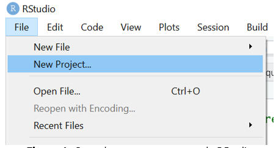
```


También accedemos a generar un proyecto nuevo a partir de pulsar sobre **New Project...** del menú desplegado en el extremo derecho superior de la interface de RStudio.

```{r,echo=F,  fig.align='center', out.width = "40%", dpi=300}
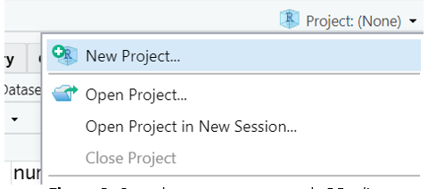
```

En cualquiera de los dos casos aparecerá un cuadro de diálogo que presenta algunas opciones para crear el **nuevo proyecto de RStudio**.

```{r,echo=F,  fig.align='center', out.width = "40%", dpi=300}
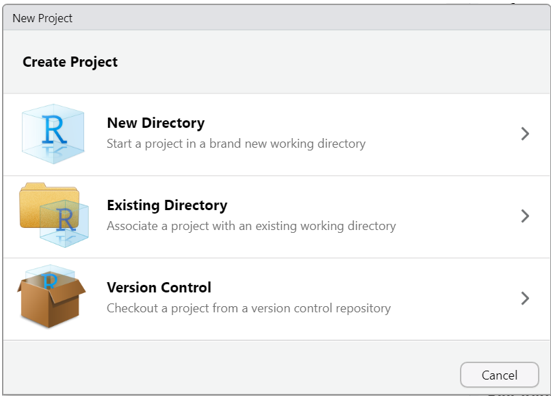
```

Por lo general, seleccionaremos la primera opción, **New Directory**, que crea una nueva carpeta a la que deberemos colocarle un nombre. Esta es la forma de crear un nuevo proyecto cuando aún no tenemos archivos dentro de alguna carpeta con los que deseemos trabajar.

En el caso que tengamos algunos archivos de código o archivos de datos con los que necesitemos trabajar, podemos elegir la segunda opción, **Existing Directory**. El proyecto tomará el nombre de la carpeta que seleccionemos en forma predeterminada.


### Tipos de proyectos

Existen varios tipos de proyectos pero nosotros en este curso utilizaremos solo la primera opción, que nos abre la siguiente ventana.


```{r,echo=F,  fig.align='center', out.width = "40%", dpi=300}
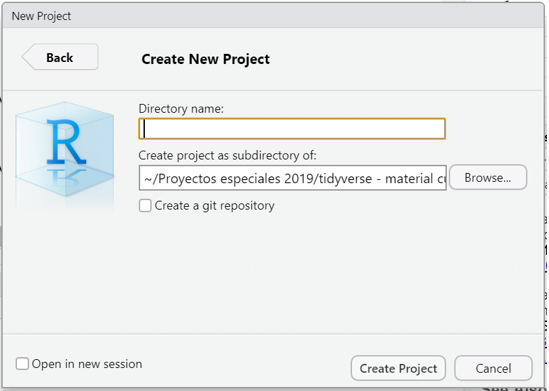
```
Debemos completar los dos campos. 

En **Directory name** hay que escribir el nombre de la nueva carpeta que también será el nombre de nuestro proyecto.

En **Create Project as subdirectory of:** podemos pulsar sobre el botón *Browse...* y navegar por nuestro *Explorador de Archivos* hasta ubicar la carpeta donde queremos que se ubique el nuevo proyecto con su nueva carpeta asociada.

Finalmente hacemos click en el botón **Create Project**.

Supongamos que nombremos a nuestro nuevo proyecto como *“Practica R”* y que lo generamos dentro de la carpeta *Mis Documentos*.

```{r,echo=F,  fig.align='center', out.width = "40%", dpi=300}
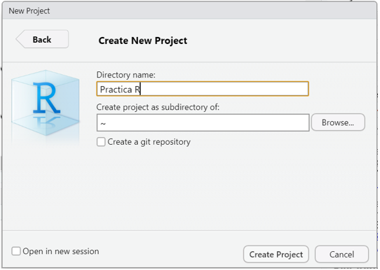
```

Este nuevo proyecto de RStudio se almacenará en la carpeta **Practica R** que encontraremos en *Mis Documentos*. 

Los proyectos de RStudio tienen sus propios entornos, por lo que si cerramos o cambiamos de proyecto, nuestra configuración se mantendrá inalterable.

Esto es cierto para los scripts y cualquier otra cosa que se pueda necesitar para un análisis, mientras esté almacenado dentro de esa carpeta de trabajo. 

Echemos un vistazo a lo que RStudio realizó.

```{r,echo=F,  fig.align='center', out.width = "40%", dpi=300}
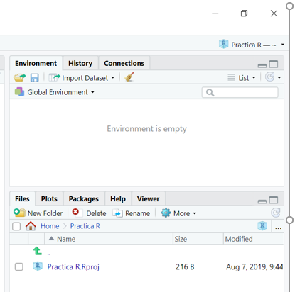
```

En la figura anterior podemos ver dos cambios en la pantalla de inicio.  

En primer lugar el panel Files (pantalla inferior derecha) apunta a la nueva carpeta Practica R y dentro de ella vemos un nuevo archivo el nombre del proyecto y la extensión **Rproj**. Este archivo contiene todas las configuraciones del proyecto. 

El otro cambio se observa en la parte superior derecha, que muestra el nombre del proyecto activo. 

## Scripts


Como dijimos en *Introducción al lenguaje R* un script es un archivo de código que contiene un listado secuencial de funciones para ser ejecutadas por el interprete. Estos archivos permiten guardar el código que vamos  creando y volver a utilizarlo tantas veces como se quiera, además de poder compartirlo con otras personas.

### Cómo creamos un script nuevo en RStudio?

Tenemos dos formas de crear un script nuevo. Desde el menú superior pulsando **File > New File > R Script** (atajo Ctrl+Shift+N) o con el ícono del documento con un símbolo +, como se muestra debajo.

```{r,echo=F,  fig.align='center', out.width = "30%", dpi=300}
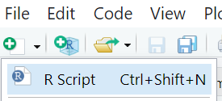
```

### Cómo editamos un script en RStudio?

Si queremos comenzar a escribir código o modificar alguna línea ya escrita vamos a utilizar el editor de código.

Este editor posee algunas herramientas especiales que nos facilitan el trabajo, evitando problemas de sintaxis entre otras ventajas.

Estas herramientas las vamos a detallar más adelante.


### Cómo ejecutamos un script en RStudio?

La forma de ejecutar habitualmente el código escrito, es línea por línea mediante el uso de la combinación de teclas **_Ctrl+Enter_** o el **botón Run** del editor de código de RStudio. Para esto tenemos que tener el cursor activo en la línea que queremos correr (puede ser en cualquier parte de la línea) y luego de ser ejecutada el cursor saltará automáticamente a la siguiente línea que tenga código.

Mientras ejecutamos cada línea debemos ir observando la salida en la consola y también los cambios que se dan en el bloque Environment (Entorno) donde aparecerán los objetos que vayamos creando y modificando.

### Cómo guardamos un script en RStudio?

Cualquier código agregado o modificación que hayamos realizado al script que nos interese mantener nos obligará a guardar el archivo.

Basta con pulsar sobre el ícono del diskette celeste del editor de código para guardar el script, o bien hacerlo desde el menú principal **File > Save** o presionando el atajo **Ctrl+S**.

Si en cambio quisiera guardarlo como otro archivo para mantener el script original, podemos guardarlo con diferente nombre mediante **File > Save As...**

### Cómo abrimos un script en RStudio?

Los scripts que construyamos o bien que nos compartan siempre tendrán  extensión **.R** y generalmente, se encontrarán dentro de algún proyecto.

Para abrir estos archivos .R podemos pulsar sobre ellos dentro del panel Files (abajo a la derecha) o bien desde el manú con **File > Open file...** (atajo de teclado Ctrl+O)

Visualizaremos el script en una nueva pestaña en el editor de código.

## Herramientas de RStudio

### Asistente de código

Cuando escribimos desde el teclado en el editor de código o en la consola de RStudio, aparece un asistente de forma automática que autocompleta las funciones que vamos tipeando.

Esta herramienta de autocompletado también se ejecuta pulsando la **tecla de tabulación** (**Tab**) y nos muestra las posibilidades de finalizar las palabras que vamos escribiendo junto al esquema de argumentos obligatorios que tiene asociado dicha función. Solo debemos presionar Enter para seleccionar el término correcto.

```{r,echo=F,  fig.align='center', out.width = "50%", dpi=300}
knitr::include_graphics("RS1.PNG")
```

Al sistematizar la escritura de código apoyandonos en el uso del autocompletado vamos a reducir la tasa de errores de sintaxis, dado que las funciones, los argumentos y los nombres de las tablas y variables de nuestros datos van a estar correctamente escritos.

### Ayuda en línea

Si necesitamos acceder a una ayuda adicional en línea bastará que presionemos la **tecla F1** con el cursor situado sobre el nombre de la función escrita en el editor de código para que aparezca la información relacionada en el **bloque Help** de Rstudio (generalmente panel abajo a la derecha).

```{r,echo=F,  fig.align='center', out.width = "50%", dpi=300}
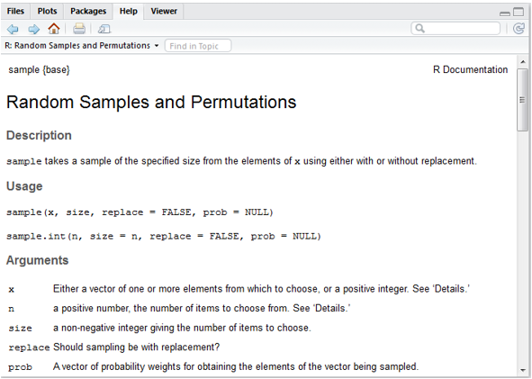
```


### Historial de funciones

Otra característica de utilidad dentro de la **Consola** de RStudio es que si nos  situamos en el prompt activo, y pulsamos las teclas flecha hacia arriba o abajo, veremos pasar la lista completa de código ejecutado en la sesion de trabajo.

Esto nos ayuda a la hora de volver a ejecutar una función o bien cuando debemos hacer alguna corrección de la o las líneas anteriores, puesto que nos ahorra tiempo y trabajo evitando volver a tener que tipear lo que ya escribimos.

Este historial de funciones también lo encontramos en el bloque superior derecho de RStudio, dentro de la pestaña **History**.

History almacena todos las funciones ejecutados en consola de forma acumulativa, incluso anidando sesión tras sesión.

Los comandos que aparecen en ese panel se pueden copiar y pegar en la Consola o, de forma más directa, puedes seleccionar uno de ellos con el mouse, y pulsar en el **botón To Console** (Enter) para insertarlo en consola o **To Source**  (Shitft+Enter) para insertarlo en el script activo en el que estemos trabajando.

```{r,echo=F,  fig.align='center', out.width = "50%", dpi=300}
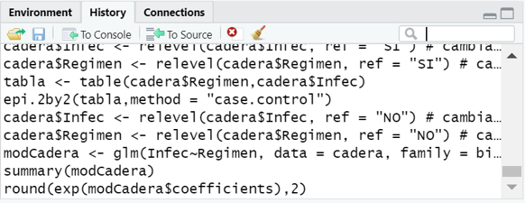
```


### Atajos de teclados relevantes (para Windows)

|**Menú Archivo (File)**     |                             |
|:---------------------------|:----------------------------|
|Ctrl+Shift+N                |Crea un nuevo script         |
|Ctrl+O                      |Abre un script guardado      |
|Ctrl+S                      |Guarda el script activo      |
|Ctrl+W                      |Cierra el script activo      |
|Ctrl+Q                      |Sale del programa RStudio    |
|**Menú Edición (Edit)**     |                             |
|Ctrl+F                      |Abre la ventana de búsqueda (para buscar palabras dentro de un script)    |
|Ctrl+L                      |Limpia la consola                                                          |
|**Menú Código (Code)**      |                             |
|Ctrl+Enter            |Ejecuta la línea de código donde está situado el cursor    |
|Ctrl+Alt+R            |Ejecuta todo el código del script activo                   |

## Paquetes (librerías)

R consta de un sistema base y de librerías adicionales, llamados paquetes (packages) que extienden su funcionalidad.

Siendo **open source** cualquier persona puede construir paquetes con nuevas funciones, aunque no todos se publican en el repositorio CRAN (Comprehensive R Archive Network).

Un grupo de paquetes conforman el sistema base que quedan activos cuando instalamos el software R.

Otros paquetes se encuentran publicados en el repositorio para ser descargados cuando sea necesario. Actualmente existen más de 19000 paquetes para múltiples aplicaciones.

Existen dos formas de descargar estos paquetes, directamente desde RStudio/R y por medio del sitio web, descargándolos como archivos comprimidos .zip 

Si el equipo se encuentra conectado a Internet es más cómodo realizar las descargas desde RStudio, pero en el caso de no tener acceso permanente a la red, se pueden descargar desde la web en otro equipo y luego guardar en el equipo donde tenemos el programa R.

El sitio web para las descargas de los paquetes publicados es https://cran.r-project.org/web/packages/

Allí se encuentran los enlaces para ver el listado de paquetes ordenados alfabéticamente o por fecha de publicación.

Una vez que ingresamos al link del paquete que nos interesa veremos en la página algunos datos relacionados como un breve texto de que trata el paquete, el numero de versión, la fecha de publicación, el autor, el archivo de documentación, y por supuesto los archivos a descargar para cada sistema operativo.

Afortunadamente en la actualidad la mayoría de las computadoras cuentan con acceso a Internet por lo cual explicaremos como se puede descargar, instalar y activar los paquetes desde RStudio.

RStudio tiene una pestaña específica para gestionar los paquetes ubicada de forma predeterminada en el bloque inferior derecho de la interfaz (**Packages**)

```{r,echo=F,  fig.align='center', out.width = "100%", dpi=300}
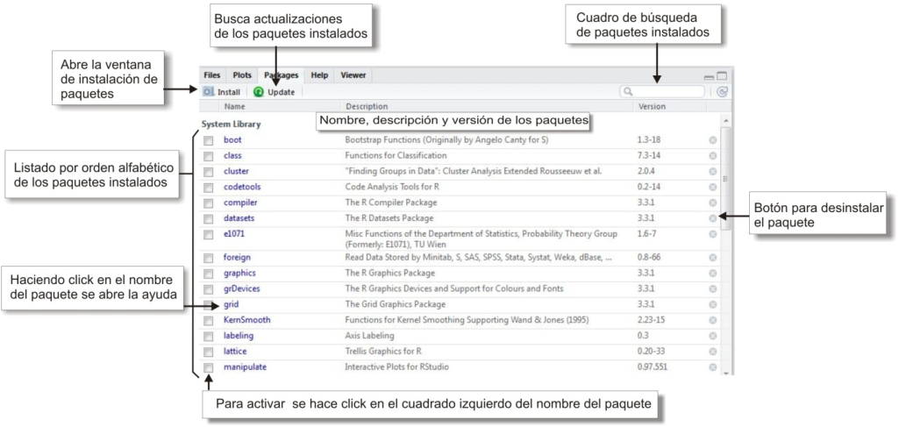
```

Prácticamente todos las acciones que nos facilita la interfaz de RStudio se traduce internamente en ejecuciones de funciones de R que podemos ver en la consola. 

La secuencia para instalar un paquete que no tengamos previamente instalado inicia a partir de pulsar el **botón Install** y la ventana emergente que visualizaremos es la siguiente:

```{r,echo=F,  fig.align='center', out.width = "80%", dpi=300}
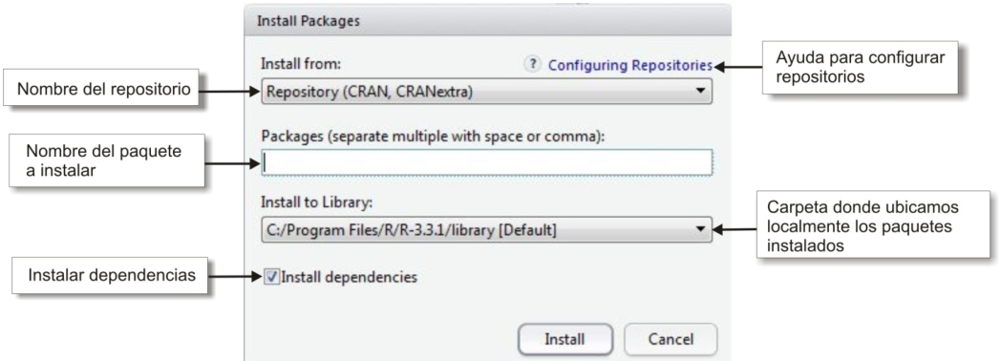
```

### Dependencias

La gran mayoría de las funciones que integran los paquetes que podemos descargar y utilizar están construidas en el mismo lenguaje R y para su elaboración se usan muchas veces funciones pertenecientes a otros paquetes.

Que pasa cuando queremos ejecutar una función que necesita de otra que no tenemos instalada? Sucede que no es posible ejecutarla dado que no puede encontrar la o las funciones que están siendo llamadas en su propio código y no existen en la actual instalación de R; por lo tanto nos devolverá un mensaje de error alertando por la función desconocida.

Esta relación de funciones que llaman a otras funciones se denomina **_dependencia_**. Es decir, que un paquete puede depender de otro u otros que tienen funciones que son llamadas y por ende, debe asegurarse su previa instalación para evitar el error.

Hay una forma de asegurarnos cuando instalamos un paquete que a su vez se instalen los paquetes del cual depende y es marcando la opción **Install dependencies**  en la ventana anterior (**Install Packages**).


## Lectura de archivos de datos

El lenguaje nos permite importar variados formatos de tablas de datos utilizando funciones propias de R base como de paquetes que se dedican a esta tarea.

El formato nativo de tablas de datos de R es el texto plano (*ASCII* - Codigo Estadounidense Estandar para el Intercambio de Informacion) con sus columnas separadas por algún caracter. Estos pueden ser caracteres habituales como la coma (,) o el punto y coma (;) que da lugar a la extensión **\*.csv**, o algunos especiales como la barra vertical (|) que suele utilizar el INDEC para sus productos o bien cualquier otro, como espacios o la tabulación.

Otra característica que tienen estos archivos es que generalmente poseen una cabecera donde se ubican los nombres de cada columna/variable y por supuesto que cada una de ellas debe respetar un mismo tipo de dato para cumplir con la condición que la hace una tabla/base de datos.

Lo más importante para hacer una buena lectura de la tabla de datos con la que deseamos trabajar es conocer previamente el formato que tiene, si tiene cabecera, que caracter usa como separador de columnas, etc. Al ser un texto plano se puede abrir desde un simple **Block de Notas** de Windows o desde el mismo **RStudio** para conocer sus particularidades.
 
Actualmente y dentro del ecosistema con el que vamos a trabajar durante este curso hay un paquete con funciones diseñadas para importar estos tipos de archivos. Se llama **readr** y su fuerte es detectar el formato que tiene cada columna en el momento de la lectura.

Posee una familia de funciones analizadoras donde se destacan:

- **read_csv()**: archivos separados por comas (CSV) 
- **read_delim()**: archivos separados con delimitadores generales 
- **read_tsv()**: archivos separados por tabulaciones 
- **read_fwf()**: archivos con columnas de ancho fijo
- **read_table()**: archivos formato tabla con columnas separadas por espacios

Todas estas funciones tiene argumentos comunes, además de **file =** donde se declara el nombre del archivo a importar entre comillas. Algunos de estos argumentos importantes son:

**col_names =** con *TRUE* le indicamos que la primera fila contiene los nombres de las columnas (con *FALSE* lo negamos)

**skip = ** salteamos una cantidad determinada de líneas que el archivo puede contener. En el caso que existan textos que no pertenecen al formato de la tabla de datos.

**locale =** es la configuración regional que el arhivo puede tener. Estos incluyen:

- Las marcas decimales y de agrupación, utilizadas al leer números.
- La codificación de caracteres, utilizada al leer cadenas que no son ASCII.
- Los nombres de meses y días, utilizados al analizar fechas.
- La zona horaria predeterminada, utilizada al analizar fechas y horas.


La adecuada configuración de este argumento evitará que palabras que tengan acentos o eñes o diferentes formatos de fecha sean bien reconocidos.

Por lo tanto, nuestra tarea es hacer coincidir el formato de origen del archivo a leer con la función y los argumentos correctos.

Durante el proceso de importación, decíamos que las funciones analizan columna por columna a que tipo de dato pertenecen. Los posibles tipos de datos son: character, integer, numeric, double, logical y date/time.

Por ejemplo, si tenemos un archivo con punto y coma de separador, vamos a utilizar **read_csv2()** y si queremos importar la tabla de datos que ofrece el INDEC para los datos de las Encuestas Nacionales de Factores de Riesgo utilizaremos **read_delim()** declarando **"|"** dentro del argumento **delim =** (única función de la familia que la incorpora).
 
Sólo como comentario, más adelante vamos a importar otros formatos de archivos que son factibles de ser leídos por el lenguaje, como **Excel**, **SPSS**, **SAS** y **Stata**. (por supuesto que responden a otros paquetes específicos que deben ser instalados)


## Agunas buenas prácticas de trabajo

- Agrupar nuestros datos, scripts y resultados dentro de proyectos de RStudio (Rproj)
- Declarar en el inicio de los scripts la activación de paquetes necesarios para ejecutar las funciones incluídas en el código. ( función **library()** )
- Documentar el código que vayamos creando por medio de comentarios (iniciados con **#**) 
- Cumplir con un correcto estilo de codificación (Intentar utilizar espacios e identación adecuada para que el código sea de fácil lectura).

<br>
<br>