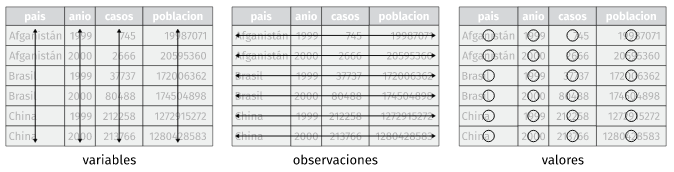
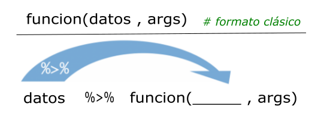

```{r setup, include=FALSE}
knitr::opts_chunk$set(echo = TRUE, dpi = 300)
```


## Introducción

Tidyverse es el nombre que se ha dado al conjunto de paquetes desarrollados a partir de la inciativa de [Hadley Wickham](https://en.wikipedia.org/wiki/Hadley_Wickham) (jefe científico de Posit -antes RStudio-) y su equipo, para ciencia de datos con R. 

Estos paquetes están diseñados para funcionar juntos y comparten una misma filosofía, que se puede consultar en [The tidy tools manifesto](https://cran.r-project.org/web/packages/tidyverse/vignettes/manifesto.html). 

Los cuatro principios básicos en los que se basa son:

- Reutilizar las estructuras de datos
- Resolver problemas complejos combinando varias piezas sencillas
- Utilizar programación funcional
- Diseñado para humanos

Los paquetes incluidos en el tidyverse tienen como objetivo cubrir todas las fases del análisis de datos dentro de R:  importar datos, ponerlos en formato ordenado (tidy data), buscar relaciones entre ellos (mediante su transformación, visualización y creación de modelos) y comunicar los resultados. 

La palabra "tidy" se puede traducir como "ordenado" y refiere a que los datos deben cumplir con una estructura determinada donde:

- Cada **_variable_** es una *columna* de la tabla de datos.
- Cada **_observación_** es una *fila* de la tabla de datos.
- Cada **_tabla_** responde a una *unidad de observación o análisis*.

```{r,echo=F,  fig.align='center', out.width = "60%"}

```

Además de los paquetes principales que realizan estas funciones, al instalar el tidyverse también se proporcionan otros que ayudan a trabajar con fechas, cadenas de caracteres o factores siguiendo los mismos principios.

Una de las interesantes incorporaciones transversales en el ambiente tidyverse es el uso de tuberías (pipe en inglés).

Una tubería conecta un trozo de código con otro mediante el conector `%>%` que surge del paquete __magrittr__ que permite transformar llamadas de funciones anidadas (con muchos paréntesis) en una simple serie de operaciones que son más fáciles de escribir y comprender. Esta idea fue tan importante que el equipo de desarrolladores que mantiene el lenguaje incorporó la idea a partir de la versión 4.1.0 de 2021, agregando la funcionalidad nativa con el operador `|>`.

**Nota:** *durante el curso pueden llegar a coexistir ambas tuberías, dado que funcionan igual. De todas maneras, al utilizar versiones actualizadas del lenguaje preferimos utilizar la tubería nativa que es más eficiente que la propia del tidyverse.*

La idea de tubería responde al principio donde cada función es un paso y la forma de trabajar se puede ver en el siguiente esquema general:

```{r,echo=F,  fig.align='center', out.width = "40%"}

```

__Base gramatical__

La intención de los desarrolladores para este conjunto de paquetes es lograr incorporar una gramática a la sintaxis de las funciones y sus argumentos buscando un entendimiento semántico más claro.

Una prueba de ello, es que la mayoría de las funciones son verbos que se entrelazan con objetos y argumentos que permiten construir *"frases"*. 


## El paquete de paquetes

El paquete tidyverse nucleo actual (versión 2.0.0) se puede descargar del repositorio oficial CRAN mediante menú **Packages** de **RStudio** o ejecutando en consola:

```{r, eval=F}
install.packages("tidyverse")
```

Se activa, como cualquier otro paquete, mediante:

```{r, warning=FALSE}
library(tidyverse)
```

observamos que nos informa sobre la versión del paquete, el listado de paquetes que acabamos de activar sólo llamando a tidyverse y una serie de conflictos de nombres de funciones.

Esto es muy habitual cuando activamos varios paquetes, dado que las funciones que se encuentran dentro de ellos pueden llamarse iguales.

Por ejemplo, existe en el paquete base stats y en el paquete dplyr (que es parte de tidyverse) una función llamada `filter()`, por lo tanto al activar tidyverse nos informa de esta manera: **dplyr::filter()    masks stats::filter()**

En este caso, cuando necesitemos asegurarnos que la función que deseamos ejecutar pertenece a determinado paquete, es recomendable escribirla de la siguiente forma:

> nombre_paquete::nombre_función

**stats::filter()** para la función **filter()** del paquete **stats**

**dplyr::filter()** para la función **filter()** del paquete **dplyr**

Los paquetes incluidos que se instalan en esta versión son 31:

```{r}
tidyverse_packages()
```

Existen otros paquetes (la cantidad crece con el tiempo) que son creados bajo la misma filosofía pero no están incluidos. En esos casos hay que instalarlos y activarlos individualmente.

Para profundizar sobre **tidyverse** se puede visitar el sitio  https://www.tidyverse.org/ y la primera versión del libro traducido al español [r4ds](https://es.r4ds.hadley.nz/index.html).

## Paquetes relevantes

Durante el curso iremos presentando y trabajando con los más relevantes de estos paquetes que integran tidyverse.

**readr**

Permite leer y escribir archivos de texto plano (ASCII) separados por comas o algun otro caracter. 

**readxl**

Lo usaremos para importar tablas de datos provenientes de archivos Microsoft Excel, tanto es su formato viejo \*.xls como actual \*.xlsx.

**haven**

Importa y exporta datos de otros software de análisis estadístico como SPSS, Stata y SAS.

**dplyr**

Es el paquete central para la manipulación y gestión de datos de tidyverse. Proporciona funciones/"verbos" simples, que corresponden a las tareas de manipulación de datos más comunes, para ayudarlo a traducir sus pensamientos en código.

**tidyr**

Nos facilita herramientas que sirven para dar formato necesario a las tablas de datos, sus variables y observaciones.

**lubridate**

Aporta funciones para el trabajo con fechas y períodos de tiempo.

**stringr**

Posibilita la manipulación de cadenas de caracteres y patrones (expresiones regulares)

**forcats**

Destinado a facilitar la gestión de variables categóricas (factores)

**ggplot2**

Un sistema de visualización de datos basado en una "gramática de gráficos"
