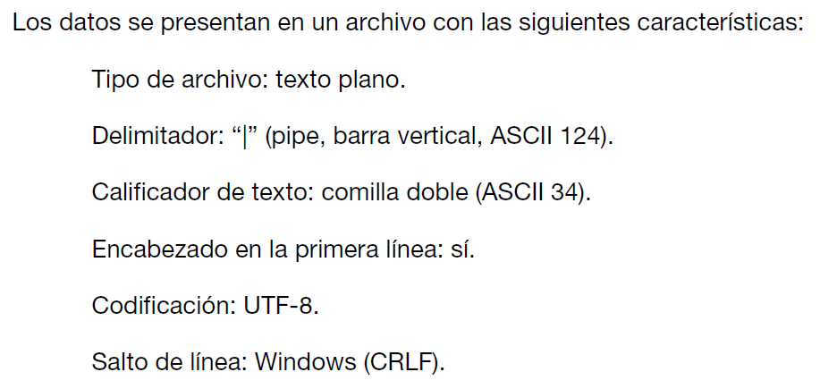
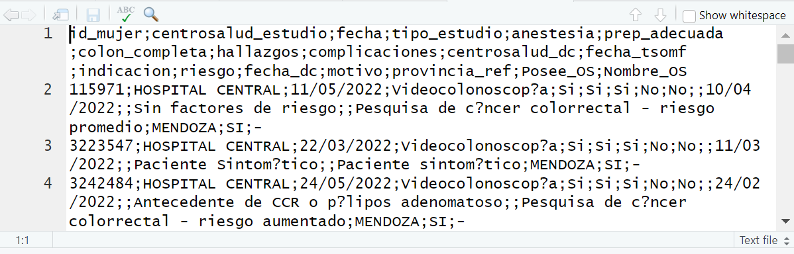

```{r setup, include=FALSE}
knitr::opts_chunk$set(echo = TRUE, dpi = 300)
```


## Introducción

Anteriormente dijimos que para leer o importar datos de un archivo de texto plano separado por comas vamos a utilizar alguna de las funciones del paquete **readr** del tidyverse.

Pero para saber cual es la función adecuada y para adaptar sus argumentos correctamente vamos a necesitar conocer la configuración del archivo de datos.

En este paso a paso, mostraremos las etapas a ejecutar ante una situación de lectura.

En primer lugar, es deseable que conozcamos previamente los archivos con los cuales trabajamos, o bien si son archivos de datos que se reciben de alguna fuente externa vengan acompañados de un diccionario de datos con especificaciones técnicas del propio archivo como de sus variables.

Un ejemplo de esto es el detalle técnico de la tabla de datos que figura en el documento usuario de la **Encuesta Nacional de Factores de Riesgo** que vemos debajo:

```{r,echo=F,  fig.align='center', out.width = "60%", dpi=300}

```

Esta información nos dice que el archivo es de texto plano, utiliza como delimitador de columna a la barra vertical, que la primera línea lleva los nombres de las variables y que la codificación (encoding) de los caracteres tiene el estándar UTF-8.

En función de estos datos podríamos componer nuestra lectura de la siguiente forma:

```{r, eval=F}
enfr <- read_delim(file = "ENFR2013_base_usuario.txt", 
                   delim = "|", 
                   locale = locale(encoding = "UTF-8"))
```

Aunque es el estándar predeterminado, completamos el argumento del encoding a propósito para mostrar como se vincula cada parte de la función con la información del archivo de datos.

Si no llegasemos a disponer de esta información es muy posible que debamos investigar el archivo que deseamos importar para saber sus características.

En este documento utilizaremos el archivo **vcc_prueba.csv** que nos facilitaron desde el INC.

## Separador o delimitador de columnas

La primera cosa que podemos hacer con un archivo de texto plano es abrirlo con un software tipo block de notas o con el mismo RStudio para saber cual es el caracter que utiliza como separador de columnas. 

Cuando el archivo tiene extensión csv generalmente el separador puede ser coma o punto y coma. Pero recién vimos que la extensión puede ser txt y el separador, alguno de los caracteres habituales (espacio, tabulación, etc).

Desde **RStudio**, cuando se pulsa el botón izquierdo del mouse sobre el archivo de datos que aparece en el panel *Files*, se abre una ventana emergente que nos ofrece la posibilidad de visualizarlo en el editor ("View File")

Veríamos algo así:

```{r,echo=F,  fig.align='center', out.width = "70%", dpi=300}

```

Podemos identificar claramente que el caracter que se repite como delimitador es el punto y coma (;). Si hubiese datos numéricos con decimales, también es importante identificar cual es el separador de decimales (en los casos de delimitadores de columna con punto y coma, la coma se utiliza para los decimales, pero exiten situaciones donde el separador de decimales aún puede ser el punto).

También se puede advertir que la primera línea corresponde a los nombres de las columnas (variables) de nuestra tabla de datos.

Con esta información seleccionaremos como función de lectura a `read_csv2()` que tiene estos valores de separadores como predeterminados.

## Encoding

Para conocer cual es la codificación del archivo podemos usar una función del paquete **readr**, llamada `guess_encoding()`.

```{r, message=F, warning=FALSE}
library(readr)

guess_encoding("vcc_prueba.csv")
```

El resultado nos informa de dos estándares ISO-8859-1 e ISO-8859-2, aunque la confianza del primero casi duplica al segundo.

A partir de tener esta información podemos configurar el argumento necesario para hacer una lectura correcta de los caracteres especiales que puede tener el archivo.

```{r}
vcc <- read_csv2("vcc_prueba.csv", 
                 locale = locale(encoding = "ISO-8859-1"))
```
La ejecución de la función nos confirma que se realizó usando:

- la coma como decimal y el punto como separador de miles. 
- que se importaron 2595 filas y 18 columnas. 
- el delimitador fue el punto y coma
- detectó 14 variables de tipo character, 1 numérica y 3 lógicas (posiblemente vacías)

Veamos 10 observaciones para verificar la lectura:

```{r, echo=F, message=F, warning=F}
library(tidyverse)

vcc |> slice(1:10)
```

Y respecto a los caracteres especiales mostremos las distintas categorías de la variable **riesgo**, por ejemplo:

```{r, message=F, warning=F}
vcc |> 
  distinct(riesgo) |> 
  arrange(riesgo)
```
Verificamos que los acentos se visualizan bien, en palabras como "Sintomático" o "pólipos".

Ahora reiteremos la lectura de datos pero sin configurar la "codificación" de caracteres.

```{r, message=F, warning=F}
vcc_sin_encoding <- read_csv2("vcc_prueba.csv")
```

Comparemos las categorías de la variable **riesgo**.

```{r}
vcc_sin_encoding |> 
  distinct(riesgo) |> 
  arrange(riesgo)
```

Observemos que en lugar de los acentos aparecen una serie de símbolos extraños producto de intentar la importación con un estándar no coincidente con el formato del archivo de origen.

