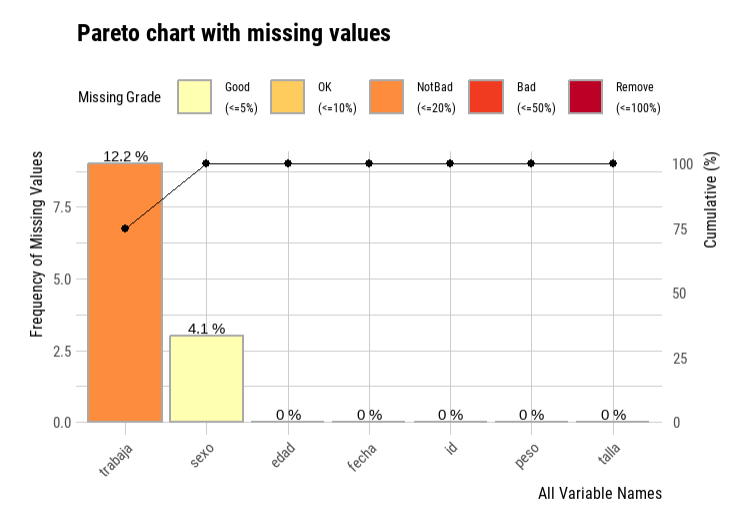
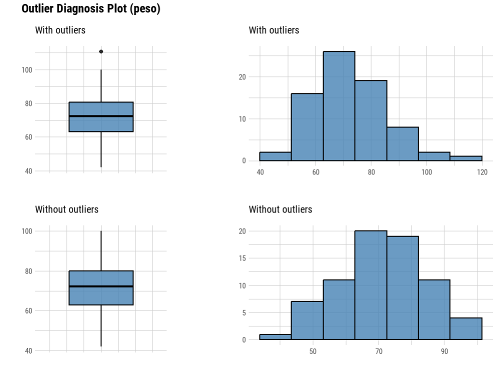

```{r setup, include=FALSE}
knitr::opts_chunk$set(echo = TRUE, dpi = 300)
```


## Exploración de tablas de datos

El primer paso en la exploración de un conjunto de datos es conocer su estructura y tamaño.

El tamaño está definido por la cantidad de observaciones (filas) y la cantidad de variables (columnas).

Llamamos estructura a la forma en se organizan sus variables, sus tipos de datos y sus categorías/valores.

```{r, echo = F, message=FALSE, warning=FALSE}
library(tidyverse)
library(readxl)
library(lubridate)
datos <- read_excel("datos.xlsx", col_types = c("numeric", "text", "numeric", "numeric", "numeric", "logical", "date")) %>% 
  mutate(fecha = as.Date(fecha),
         id = as.integer(id))
datos <- as.data.frame(datos)
```

Vamos a utilizar un dataframe de ejemplo con variedad en sus tipos de datos. Para ver su estructura en R base tenemos la función `str()`

```{r}
str(datos)
```
Nos informa que la tabla tiene 74 observaciones y 7 variables con su tipo de dato al lado. 

En R base los tipos de datos son:

- **int** (integer): números enteros
- **num** (numeric): números reales
- **chr** (character): caracteres (texto)
- **logi** (logical): valores lógicos
- **Date**: fechas
- **fct** (factor): factores

En tidyverse, la función que reemplaza a str() es `glimpse()`:


```{r}
glimpse(datos)
```
Parece idéntica pero tiene una ventaja cuando la tabla de datos tiene muchas variables. La lista de respuesta de str() se trunca y no nos deja visualizar la totalidad de columnas, cosa que si hace glimpse().

Por otra parte vamos a encontrar distintas definiciones para los tipos de datos, del modo tidyverse:

- num para a ser **dbl** (double): números reales
- logi para a ser **lgl** (logical): valores lógicos

Y se incluyen un tipo nuevo:

- **dttm** (date-time): fechas y horas

Esta exploración inicial de la estructura generalmente viene acompañada por el "diccionario de datos" (codebook) asociado a la tabla de datos, ya sea que esta tabla provenga de un proyecto de investigación propio (fuente primaria), producto de una fuente secundaria o de un sistema de vigilancia epidemiológica. 

## Comprobación y coerción de tipos de datos

La mayoría de las funciones producen un error cuando el tipo de datos que esperan no coincide con los que pasamos como argumentos. En esta situación seguiremos el siguiente camino:

- Comprobar el tipo de datos utilizando las funciones `is.*()`, que nos responden con un valor lógico (TRUE si el tipo de dato coincide y FALSE si no lo hace). 
Si el tipo de dato coincide con el formato esperado por el argumento de la función, entonces podemos aplicarla, de lo contrario necesitaremos continuar:

- Forzar el tipo de datos deseado coercionando con funciones de la familia `as.*()`, que fuerzan el tipo de datos, siempre y cuando esto devuelva valores correctos. Por ejemplo, no podremos obtener valores correctos si intento coercionar caracteres a tipos numéricos.

```{r}
# Ejmeplo coercionando la variable sexo de caracter a factor

as.factor(datos$sexo) # llamamos a la variable con el formato <dataframe>$<variable>

# detecta que hay dos niveles o categorías posibles (F y M) 

is.factor(as.factor(datos$sexo))

# nos confirma que los datos se coercionaron a factor
```


- Transformar el tipo de dato a partir de aplicar funciones específicas incluidas en paquetes que gestionan datos especiales, como por ejemplo las fechas (el paquete *lubridate* del tidyverse, que conoceremos más adelante, se ocupa de esto)

A continuación se muestra una lista con los tipos más importantes que se pueden comprobar o forzar a partir de funciones de R base:

|Tipo|Comprobación|Coerción|
|----|------------|--------|
|character|	`is.character()`|	`as.character()`|
|numeric|	`is.numeric()`|	`as.numeric()`|
|integer|	`is.integer()`|	`as.integer()`|
|double|	`is.double()`|	`as.double()`|
|factor|	`is.factor()`|	`as.factor()`|
|logical|	`is.logical()`|	`as.logical()`|
|NA|	`is.na()`|	`as.na()`|


## Detectar observaciones incompletas (valores missing)

Sabemos que los valores perdidos o faltantes (conocidos en inglés como missing) y que se gestionan en R mediante el valor especial reservado **NA**, constituyen un serio problema en nuestras variables de análisis.

Existen numerosos libros sobre como tratarlos y sobre diversos algoritmos de imputación que no vamos a incluir en este curso.

En principio, sólo vamos a enfocarnos en como podemos utilizar algunas funciones del lenguaje para detectarlos y contabilizarlos. A partir de su identificación decidiremos que hacer con ellos, dependiendo de su cantidad y extensión, es decir, si los valores faltantes son la mayoría de una variable o la mayoría de una observación.

Una manera de abordar esta tarea con R base para una variables es hacer la sumatoria de valores NA, usando la función de identificación `is.na()`:

```{r}
sum(is.na(datos$trabaja))
```
También la función summary() de R base nos devuelve la cantidad de valores faltantes:

```{r}
summary(datos$trabaja) # resumen de la variable trabaja
```

Pero para esta tarea existen algunas funciones de paquetes especialmente diseñados para realizar la exploración y diagnóstico de las tablas de datos con las que trabajemos. Si bien, hay muchas posibilidades, en el curso utilizaremos dos paquetes concretos: **skimr** y **dlookr**.

## skimr

La función principal **skim()** de esta librería permite obtener un resumen de los datos y conocer de manera general su estructura.

```{r, message=F, warning=F}
library(skimr)

datos |> 
  skim()
```
Observemos que por cada tipo de datos diferente muestra una tabla de resumen particular, además del resumen general que encabeza cada ejecución.

El resultado anterior nos arroja una idea del comportamiento de las variables además de entregar información acerca de los valores ausentes **NA**. Un histograma con la distribución de las variables numéricas es representado en el resumen para darnos una idea de su distribución.


## dlookr

Sabemos que cada vez que importemos datos crudos debemos explorarlos y verificar su calidad a fin de hacer las transformaciones necesarias o correcciones para producir los datos limpios que necesitamos para comenzar nuestro análisis.

El paquete dlookr hace que estos pasos de exploración y diagnóstico sean rápidos y sencillos. También posee funciones para la imputación y la transformación de datos que no utilizaremos en el curso.

Para la etapa del diagnóstico el paquete ofrece una serie de funciones que comienzan con la palabra `diagnose`.

Mostraremos la ejecución sobre el dataframe de ejemplo:

```{r, message=F, warning=F}
library(dlookr)

diagnose(datos)
```

Podemos conocer rápidamente los tipos de datos, la cantidad de datos NA de cada variable y los valores únicos.

Con `diagnose_category()` visualizamos una tabla de frecuencia de las categorías de las variables y podemos separar aquellas que son tipo fecha.

```{r}
diagnose_category(datos, add_date = F)
```

```{r}
diagnose_category(datos, add_character = F)
```
También podemos hacerlo con las variables numéricas, obteniendo un resumen completo de la distribución, el conteo de valores cero, negativos y atípicos.

```{r}
diagnose_numeric(datos)
```

Respecto de los valores outlier la función `diagnose_outlier()` se ocupa de ellos, mostrando entre otros elementos la media de la distibución teniendo en cuenta estos valores atípicos y la media no incluyéndolos.

```{r}
diagnose_outlier(datos)
```

Para la exploración de valores faltantes existen un par de funciones específicas.

```{r, message=F, warning=F}
find_na(datos, rate = T)
```

A la función `find_na()` podemos aplicarla a todo el dataframe y nos dice que porcentaje de valores NA hay en cada variable. En este ejemplo la variable *sexo* tiene alrededor de un 4 % de valores faltantes y *trabaja* un poco más de 12 %.

La otra es una función llamada `plot_na_pareto()` donde observamos el mismo resultado pero en forma gráfica.

```{r, eval=FALSE}
plot_na_pareto(datos)
```

```{r,echo=F,  fig.align='center', out.width = "70%", dpi=300}

```

También hay una manera de visualizar que pasa con una variable numérica con outliers a través de gráficos.

```{r, eval=F}
datos |> 
   plot_outlier(peso)
```

```{r,echo=F,  fig.align='center', out.width = "70%", dpi=300}

```

Lo interesante de estos boxplots e histogramas es que se comparan las distribuciones de la variable teniendo en cuenta y excluyendo los valores atípicos.

La potencia de estas funciones de dlookr, como también skim() de skimr  aumenta cuando se combinan con funciones propias de **dplyr** (paquete encargado de la gestión de datos del tidyverse). Veremos que se logra una sinergia propia del ecosistema tidyverse que mejora la eficiencia de la etapa del diagnóstico de datos.


