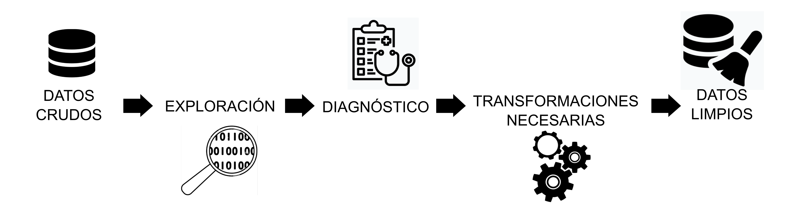

layout: true
class: animated, fadeIn


```{r setup, include=FALSE}
options(htmltools.dir.version = FALSE, htmltools.preserve.raw = FALSE)
library(xaringan)
```

```{r xaringan-themer, include=FALSE, warning=FALSE}
library(xaringanthemer)
style_mono_accent(base_color = "#00746B", 
                  colors = c(red = "#f34213",
                             blue = '#0000ff',
                             purple = "#3e2f5b",
                             orange = "#ff8811",
                             green = "#1d771d",
                             white = "#FFFFFF"))
```

---
background-image: url(assets/tipos.PNG)
background-size: 400px
background-position: 15% 60%

## Tipo de datos

.pull-right[  
.font110[ 
- Los vectores, como otras estructuras de datos, o bien las variables de un dataframe siempre se identificarán con un tipo de dato particular.

- Es importante conocer con que **tipo de dato** estamos trabajando y reconocer si se corresponde con la **clasificación de la variable** que representa.

- Por ejemplo: hay variables categóricas que se almacenen codificadas con números. El tipo de datos en R será numérico pero sería un error realizar cálculos matemáticos o estadísticos con ellos, ya que solo representan a categorías de una variable cualitativa.

- Es indispensable tener acceso al diccionario de datos (*codebook*) de una tabla/base de datos.
]
]
---
## Coerción

.font140[
Los tipos de datos definidos en el lenguaje R pueden ser coercionados, es decir convertidos a otro tipo. Esta coerción puede ser implicita o explicita:

- **Implícita** es la coerción que el sistema aplica al encontrar una o más observaciones con un tipo de dato no coincidente. 

El tipo de dato que se impone es aquel que fuerza una conversión posible. Esto sucede también al momento de hacer la importación de los datos.
]

.font110[

```{r}
# Ejemplo

c(3, 2, 7, 6, 4) # vector numérico

c(3, 2, "siete", 6, 4) # coerción implicita de numérico a caracter 

```

]
---
## Coerción

.font140[
- **Explícita** es la coerción que se logra por la aplicación de la familia de funciones que comienzan con el prefijo **as.**

Esta familia es muy amplia, por lo que solo mostraremos las más básicos:
]


```{r}
# de numérico a caracter

as.character(c(3, 2, 7, 6, 4))

# de lógico a numérico

as.numeric(c(T, F, F, T, T)) # T = 1 y F = 0

# de numérico a lógico

as.logical(c(1, 0, 5, 6, 9)) # 0 = FALSE y distinto de 0 = TRUE

```

---
## Valores faltantes

.font140[
Vimos que la ausencia de valores en el lenguaje se representa con el valor especial **NA** lo que permite su reconocimiento y consideración en el uso de funciones sobre datos. 

Las tareas habituales de tratamiento consisten en:

- Evaluar la existencia de valores perdidos (exploración y conteo).
- Excluir los valores ausentes (si es posible y conveniente).
- Recodificar los valores ausentes (imputación de datos).

**Nota**: estos *valores especiales* tienen un efecto "contagioso" y cualquier cálculo o resumen que los contengan será igual a **NA**. Existen argumentos que deberemos utilizar para no tenerlos en cuenta (`na.rm =`)

]
---
## Exploración de datos

.font140[
La exploración de datos se puede incluir dentro del **análisis exploratorio de datos** y persigue un primer grupo de objetivos:

- Conocer la estructura de la tabla de datos y sus tipos de variables
- Detectar observaciones incompletas (valores faltantes)
- Detectar datos con errores e inconsistencias 

Habitualmente hablamos de **_calidad de los datos_** en relación a los items anteriores.

Una segunda etapa nos va servir para conocer la distribución de las variables de interés a partir de: 

- Resumir datos mediante estadísticos y gráficos
- Detectar valores atípicos (outlier)
]
---
## Diagnóstico de datos

.font140[

La etapa diagnóstica comprende:

- el conocimiento de la estructura de la tabla de datos
- la verificación del tipo de dato de cada variable de interés
- la detección de los valores faltantes en las observaciones
- las categorías de las variables cualitativas
- los mínimos y máximos de valores de cada variable cuantitativa

Hay múltiples funciones que se pueden utilizar para cubrir esta etapa. En el curso vamos a mostrar algunas pertenecientes a paquetes especialmente diseñados para la tarea.

Este diagnóstico es el punto de partida de la depuración de datos, previa a cualquier análisis.

]
---
## Paquetes especificos

.font140[
Vamos a trabajar con dos paquetes especiales que nos permiten hacer este trabajo, aunque dentro del universo de librerías de R vamos a encontrar muchos mas. 

**skimr**

Está diseñado para obtener un resumen rápido de la estructura de tablas de datos y es compatible con el ecosistema tidyverse. 


**dlookr**

Se define como una colección de herramientas que permiten el diagnóstico, la exploración y la transformación de datos. El diagnóstico de datos proporciona información y visualización de valores faltantes, valores atípicos y valores únicos y negativos para ayudarle a comprender la distribución y la calidad de sus datos.

]
---
## skimr

.font140[
La función principal del paquete es `skim` y puede ser aplicada a todo el dataframe o bien a una variable o a un grupo de ellas.
]

```{r, echo=FALSE, warning=F, message=F}
library(skimr)
library(readr)

rita <- read_csv2("assets/rita_prueba.csv", locale = locale(encoding = "UTF-8"))

skim(rita)

```

---
## dlookr

.font140[
El paquete dlookr contiene funciones que nos facilitan el diagnóstico de nuestros datos, además de otras que tienen por objetivo la exploración y transformación de ellos. 

Entre estas funciones encontramos:

`diagnose()` que proporciona información básica de las variables

`diagnose_category()` nos devuelve información detallada de las variables categóricas

`diagnose_numeric()` nos devuelve información detallada de las variables numéricas.

`diagnose_outlier()` y `plot_outlier()` proporciona información y visualización de valores atípicos.

`plot_na_pareto()` construye un diagrama de Pareto mostrando las variables con datos faltantes.

]

---
## diagnose()

```{r, warning=F, message=F, echo=F}
library(dlookr)
library(dplyr)

diagnose(rita) |> 
  mutate(across(where(is.double),~round(.x, digits = 2))) |> 
DT::datatable(
  fillContainer = F, options = list(pageLength = 9))
```

---
## diagnose_category()

```{r, warning=F, message=F, echo=F}

rita |> 
  dplyr::select(IDESTN, TPGFN, MFGN) |> 
diagnose_category() |> 
  mutate(across(where(is.double),~round(.x, digits = 2))) |> 
DT::datatable(
  fillContainer = F, options = list(pageLength = 9))
```
---
## diagnose_numeric()

```{r, warning=F, message=F, echo=F}

rita |> 
  dplyr::select(-NPAMI) |> 
diagnose_numeric() |> 
  mutate(across(where(is.double),~round(.x, digits = 2))) |> 
DT::datatable(
  fillContainer = F, options = list(pageLength = 9))
```
---

## diagnose_outlier()

```{r, warning=F, message=F, echo=F}

rita |> 
  dplyr::select(-NPAMI) |> 
diagnose_outlier() |> 
  mutate(across(where(is.double),~round(.x, digits = 2))) |> 
DT::datatable(
  fillContainer = F, options = list(pageLength = 9))
```
---
## plot_outlier()
.center[
```{r, warning=F, message=F, echo=F, fig.width= 8}

rita |> 
  dplyr::select(DGED) |> 
plot_outlier() 
```
]
---

## plot_na_pareto()

.center[
```{r, warning=F, message=F, echo=F, fig.width= 11}

rita |> 
  select(1:25) |> 
plot_na_pareto() 
```
] 

---
background-image: url(assets/datacleaning.jpg)
background-size: 380px
background-position: 90% 30%

## Depuración de datos

.pull-left[  
.font130[ 
La etapa de depuración o limpieza de datos comienza con la exploración inicial y el diagnóstico adecuado de cada variable de interés en nuestra tabla.

Luego continúa con las transformaciones necesarias de los datos de la tabla a partir del diagnóstico realizado.

]
]


```{r,echo=F,  fig.align='center', out.width = "70%"}

```


---
background-image: url(assets/transformar.PNG)
background-size: 650px
background-position: 50% 85%

## Gestión de datos

.font140[
La manipulación de variables, su transformación, la creación de nuevas variables, los cambios de escala, el formateo de categorías y todas las tareas necesarias para esta limpieza la abordaremos mediante el uso de funciones de paquetes del propio tidyverse.
]
---
class: left, middle

background-image: url(assets/dplyr.PNG)
background-size: 160px
background-position: 50% 10%


.font140[ 
<br> 
<br> 
<br> 
- **dplyr** es el paquete para **transformar datos** que pertenece al ecosistema **tidyverse**

- Implementa una **_gramática "humana"_**

- Está constituido por funciones definidas como **_"verbos"_**

- Las funciones primarias son: `select()`, `filter()`, `arrange()`, `mutate()` y `summarise()` 

- Otras funciones útiles son: `rename()`, `group_by()`, `count()`, `if_else()`, `case_when()`, `beteewn()`, `across()`, `rowwise()`, etc.
]

---
class: left, top

background-image: url(assets/select.PNG)
background-size: 500px
background-position: 50% 80%

## select()

.font140[ 
La función **select()** del inglés .bold[seleccionar], sirve para seleccionar variables (columnas) de una tabla de datos.
]


.font160[.center[  
**select**(datos, a, c)  ó  
datos |> **select**(a,c)
]]

---
## Ayudantes de selección

.font120[
Además existe un abanico de funciones que **ayudan** a una mejor selección de nombres de variables.
]

.font120[
.pull-left[  
- `everything()`: coincide con todas las variables.

- `group_cols()`: seleccione todas las columnas de agrupación.

- `starts_with()`: comienza con un prefijo.

- `ends_with()`: termina con un sufijo.

- `contains()`: contiene una cadena literal.

- `matches()`: coincide con una expresión regular.
]
]

.font120[
.pull-rigth[  
- `num_range()`: coincide con un rango numérico como x01, x02, x03.

- `all_of()`: coincide con nombres de variables en un vector de caracteres. Todos los nombres deben estar presentes; de lo contrario, se generará un error de fuera de límites.

- `any_of()`: igual que `all_of()`, excepto que no se genera ningún error para los nombres que no existen.

- `where()`: aplica una función a todas las variables y selecciona aquellas para las cuales la función regresa TRUE.
]
]
---
## Ejemplo de select()

```{r, echo=FALSE, message=F, warning=FALSE}
library(tidyverse)

```

```{r, eval=F}
# variables (columnas) de la tabla rita
ncol(rita)

```

```{r, echo=FALSE, message=F, warning=FALSE}
ncol(rita)
```

```{r, eval=F}
# seleccionamos solo variables que comienzan con "FE" (fechas)

rita |> 
  select(starts_with("FE")) 
```


```{r, echo=FALSE, message=F, warning=FALSE}
rita |> 
  dplyr::select(starts_with("FE")) |> 
DT::datatable(
  fillContainer = F, options = list(pageLength = 4))

```

---
## rename()

.font130[
Esta función posibilita **renombrar** a las variables de una tabla de datos.

La estructura básica de la función es:
]

.font150[.center[
**rename**(datos, new_name = old_name)  ó  
datos |> **rename**(new_name = old_name)
]
]

.font130[
La variación **rename_with()** permite **renombrar** variables de una tabla a través de aplicar determinadas funciones.

La estructura básica de esta función es:
]

.font150[.center[
**rename_with**(datos, función, variables)  ó  
datos |> **rename_with**(función, variables)
]
]

---
## Ejemplo de rename() y rename_with()

```{r, eval=F}
# renombramos PTESXN por SEXO

rita |> 
  rename(SEXO = PTESXN) 
```


```{r, echo=FALSE, message=F, warning=FALSE}
rita |> 
  rename(SEXO = PTESXN) |> 
  select(SEXO) |> glimpse()

```

```{r, eval=F}
# renombramos el grupo de variables que comienza con ID por sus nombres en minúsculas

rita |> 
  rename_with(.fn = tolower, .cols = starts_with("ID")) 
```


```{r, echo=FALSE, message=F, warning=FALSE}
rita |> 
  rename_with(.fn = tolower, .cols = starts_with("ID")) |>  
  select(starts_with("ID")) |> glimpse()

```
---
class: left, top

background-image: url(assets/filter.PNG)
background-size: 400px
background-position: 50% 85%

## filter()

.font140[ 
La función **filter()** del inglés .bold[filtrar], sirve para filtrar un subconjunto de observaciones (filas) de una tabla de datos a partir de una condición.

Para construir la condición se utilizan una serie de .bold[operadores de comparación] y .bold[operadores lógicos] similares a la de otros lenguajes de programación.

La estructura de la función puede ser cualquiera de las siguientes: 
]

.font160[.center[**filter**(datos, condición) ó datos |> **filter**(condición)]]

---
background-image: url(assets/operadores.PNG)
background-size: 600px
background-position: 50% 60%

## Operadores de comparación


---
background-image: url(assets/booleanos2.PNG)
background-size: 700px
background-position: 50% 60%

## Operadores lógicos (booleanos)

---
background-image: url(assets/booleanos.PNG)
background-size: 750px
background-position: 50% 60%

## Operadores lógicos (booleanos)

---
## Ejemplo de filter()

```{r, eval=F}
# filtramos observaciones que cumplan con la siguiente condición

rita |> 
  filter(PTESXN == "Mujer", 
         between(DGED, 20, 45), 
         TPGF == "C42.1" | TPGF == "C42.3") |> 
  select(IDPTE, PTESXN, DGED, TPGF)
```


```{r, echo=FALSE, message=F, warning=FALSE}
rita |> 
  filter(PTESXN == "Mujer", 
         between(DGED, 20, 45), 
         TPGF == "C42.1" | TPGF == "C42.3") |> 
  select(IDPTE, PTESXN, DGED, TPGF) |>  
DT::datatable(
  fillContainer = F, options = list(pageLength = 5))

```
