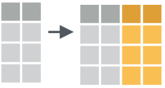

layout: true
class: animated, fadeIn


```{r setup, include=FALSE}
options(htmltools.dir.version = FALSE, htmltools.preserve.raw = FALSE)
library(xaringan)
```

```{r xaringan-themer, include=FALSE, warning=FALSE}
library(xaringanthemer)
style_mono_accent(base_color = "#00746B", 
                  colors = c(red = "#f34213",
                             blue = '#0000ff',
                             purple = "#3e2f5b",
                             orange = "#ff8811",
                             green = "#1d771d",
                             white = "#FFFFFF"))
```

---

## Operaciones simultáneas por columnas 

.font130[
Las operaciones por columnas se refieren a la aplicación de las mismas funciones-verbos de dplyr (u otras funciones de transformación de datos) a varias columnas simultáneamente.
]

.font120[
Ejemplo, creación de múltiples columnas con **mutate()**
]
```{r,echo=F,  out.width = "20%"}

```
.font120[
Ejemplo, resumiendo múltiples columnas con **summarise()**
]
```{r,echo=F,  out.width = "20%"}
knitr::include_graphics("assets/summarise_across.PNG")
```
---
class: left, top


## across()

.font140[
Esta función es la encargada de dar soporte para las operaciones múltiples (*dplyr >= 1.0.0*)
]

.center[.font160[
across(.blue[ .cols],  .orange[ .fns],  .purple[ ...],  .green[ .names])
]]

.font140[
.blue[.cols] = columnas a transformar

.orange[.fns] = función o funciones para aplicar a cada columna de .cols

.purple[...] = argumentos adicionales de las funciones especificadas anteriormente (ejemplo: na.rm = T)

.green[.names] = nombres de las columnas de salida. Aquí, `{col}` es un marcador especial al que se le puede agregar el sufijo deseado.

]

---
# Ejemplo 

.font140[
Utilizamos `across()` para transformar el tipo de datos de POSIX a Date en las fechas de la tabla HPV en solo paso.

]

```{r, echo=F, message=FALSE, warning=FALSE}
library(tidyverse)
library(readxl)

hpv <- read_excel("assets/Informe_HPV_anonimizado.xlsx")
```

```{r, echo=T}
hpv |> 
  mutate(across(where(is.POSIXct),
                as_date)) |> 
  select(where(is.Date))
```

---
## Operaciones por filas

.font140[
Las operaciones habituales dentro de los datos ordenados se realizan en columnas, pero podemos enfrentarnos a situaciones donde necesitemos hacerlo por filas.

Estas situaciones se dan cuando necesitamos hacer resúmenes por filas (calcular la media de x, y, z) o bien llamar una función varias veces con diferentes argumentos.

Un caso particular se da con tablas pivoteadas a lo "ancho" donde las columnas pasan a ser categorías de variables y junto con esta transformación las operaciones de agregados cambian de sentido vertical a horizontal.

La función que dplyr aporta para estas tareas es `rowwise()` que es parecido al `group_by()` en cuanto a que no hace nada por sí mismo, sino que funciona como metadato que trabaja con otras funciones.
]

---
## Ejemplo con tabla pivoteada

```{r, echo=F, message=F, warning=F}
tabla <- read_csv2("assets/tabla.csv")

tabla |> 
DT::datatable(
  fillContainer = F, options = list(pageLength = 6))
```

---
## Ejemplo con tabla pivoteada

.font140[
Utilizamos `rowwise()` para combinar con `summarise()` y lograr hacer un resumen como la sumatoria de variables a nivel filas. Finalmente contabilizamos por columna.
]

.font120[
```{r}
tabla |> 
  rowwise() |> 
  summarise(cantidad = sum(c(Quimioterapia, Radioterapia, Cirugía, 
                             Hormonoterapia, Otro, `Control sintomático diferente a opioides`))) |> 
  count(cantidad)
```
]
---
## c_across()

.font140[
La función `c_across()` esta diseñada para facilitar los resúmenes por fila.

Por ejemplo, para el mismo ejemplo anterior podemos simplificar la sumatoria haciendo:
]

.font120[
```{r}
tabla |> 
  rowwise() |> 
  mutate(cantidad = sum(c_across(Quimioterapia:`Control sintomático diferente a opioides`))) |> 
  count(cantidad)
```
]

---
## Estadistica descriptiva con rstatix

.font140[
El paquete **rstatix** provee un marco simple e intuitivo compatible con el uso de tuberías, coherente con la filosofía de diseño "tidyverse", para realizar pruebas estadísticas descriptivas básicas y otras más avanzadas de inferencia y modelado.

Las funciones relacionadas con la inferencia estadística, como t-test, ANOVAS, correlaciones y tamaños de efecto, así como también valores p ajustados o agregados de etiquetas de significación no serán explicados en este curso pero aquellxs estudiantes que les interese profundizar y utilizarlas le pueden sacar un provecho muy útil a este paquete. 

El sitio web del paquete es [rstatix](https://rpkgs.datanovia.com/rstatix/index.html)

]

---
## Algunas funciones

.font140[
`get_summary_stats()` devuelve un resumen de estadísticas descriptivas univariadas para variables cuantitativas
]

.font130[
```{r, message=F, warning=F}
library(rstatix)

hpv |> 
  get_summary_stats(edad, type = "common")

```
]
---
## Algunas funciones

.font130[
```{r}
hpv |> 
  get_summary_stats(edad, type = "robust")

hpv |> 
  get_summary_stats(edad, type = "full")
```

]
---
## Algunas funciones

.font140[
`freq_table()` devuelve una tabla de frecuencia absoluta y porcentual de variables cualitativas (se puede combinar más de una) 

```{r}
hpv |> 
 freq_table(resultado_hpv, metodo)
```
]

---
## gtsummary

.font140[
Este paquete proporciona una forma elegante y flexible de crear tablas analíticas y de resumen, univariadas, estratificadas y complejas.

Integran estimaciones estadísticas predefinidas y se pueden personalizar a gusto, interactuando con otros paquetes como **gt** y **labelled**.

En el sitio del desarrollador encontrarán mucha documentación para adecuar los requerimientos de la salida buscada [gtsummary](https://www.danieldsjoberg.com/gtsummary/)
]

---
## Ejemplo de resumen univariado

.font130[
```{r, message=F, warning=FALSE}
library(gtsummary)

hpv |> 
  select(edad, resultado_hpv, metodo) |>
  tbl_summary()
```
]

---
## Ejemplo de resumen estratificado

.font130[
```{r}
hpv |> 
  select(edad, resultado_hpv, metodo) |>
  tbl_summary(by = resultado_hpv)
```
]

---
## Ejemplo personalizado

.font120[
```{r}
hpv |> 
  select(edad, resultado_hpv, metodo) |>
  tbl_summary(by = resultado_hpv,
              statistic = list(
                            all_continuous() ~ "{mean} ({sd})",
                            all_categorical() ~ "{n} / {N} ({p}%)"),
     digits = all_continuous() ~ 1) |> 
    modify_header(label ~ "**Variable**")
```
]

---
## Etiquetado de valores

.font140[
El paquete **labelled** se basa en el etiquetado de variables y categorías que utiliza *SPSS*, *Stata* y *SAS* al ser importada por **haven**.

Integrado con gtsummary permite que nuestras variables y valores tengan el nombre y/o código original pero le podamos incorporar una etiqueta que se va a respetar a la hora de presentar la información en tablas y gráficos.

También provee de la creación de un diccionario de datos asociado a la tabla de datos con la que estamos trabajando
]

---
## Ejemplo de etiquetado

```{r, message=F, warning=F}
library(labelled)

hpv |> 
  select(edad, resultado_hpv, metodo) |>
  set_variable_labels(resultado_hpv = "Resultado HPV", metodo = "Metodo") |> 
  set_value_labels(resultado_hpv = c(Negativo = "NEG", Positivo = "POS"), 
                   metodo = c(Dirigida = "DIRIGIDA", Autotoma = "AUTOTOMA")) |> 
  mutate(metodo = as_factor(metodo),
         resultado_hpv = as_factor(resultado_hpv)) |> 
   tbl_summary(by = resultado_hpv)
```


---
## Exportación de tablas a word

flextable

---