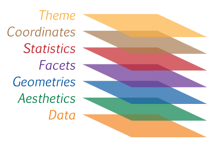

layout: true
class: animated, fadeIn


```{r setup, include=FALSE}
options(htmltools.dir.version = FALSE, htmltools.preserve.raw = FALSE)
library(xaringan)
```

```{r xaringan-themer, include=FALSE, warning=FALSE}
library(xaringanthemer)
style_mono_accent(base_color = "#00746B", 
                  colors = c(red = "#f34213",
                             blue = '#0000ff',
                             purple = "#3e2f5b",
                             orange = "#ff8811",
                             green = "#1d771d",
                             white = "#FFFFFF"))
```

```{css, echo=F}
.code {
  color: #777;
  width: 48%;
  height: 92%;
  float: left;
}
.plot {
  width: 50%;
  height: 70%;
  float: right;
  padding-left: 1%;
}
```

---
class: inverse, hide-logo, center, middle

.font180[
“Un simple gráfico ha brindado más información a la mente del analista de datos que cualquier otro dispositivo”. — *John Tukey*
]
---
## Objetivos de la visualización
<br>
<br>
<br>
.font160[


- **Análisis exploratorio**: descubrir y describir patrones en los datos (parte del Análisis Exploratorio de Datos - EDA)

- **Presentación y comunicación**: capacidad de transmitir el mensaje de forma clara y atractiva. 
]
---
background-image: url(assets/signos.png) 
background-size: 850px
background-position: 50% 75%
## Señales visuales
---
## Gramática de gráficos

.code[.font140[
De manera similar a la gramática lingüística, *"La gramática de gráficos"* define un conjunto de reglas para construir gráficos estadísticos combinando diferentes tipos de capas. 

Esta gramática fue creada por **Leland Wilkinson** (*2005, The Grammar of Graphics (Statistics and Computing). Secaucus, NJ, USA: Springer-Verlag New York, Inc.*)
]]

.plot[
```{r, echo=F}

```

]
---
background-image: url(assets/ggplot2_exploration_es.png) 
background-size: 650px
background-position: 50% 40%

.footnote[[Artwork by @allison_horst](https://twitter.com/allison_horst)]
---


---
class: left

background-image: url(assets/ggplot2.PNG), url(assets/str_ggplot2.PNG), url(assets/sistema_ggplot2.PNG)
background-size: 160px, 600px, 400px
background-position: 50% 5%, 50% 65%, 50% 95%
<br>
<br>
<br>
<br>
<br>
<br>
.font140[
**ggplot2** es un paquete que se autodefine como librería para _**“crear elegantes visualizaciones de datos usando una gramática de gráficos”**_

El paquete propone un sistema que se basa en la idea que cualquier gráfico se puede construir usando tres componentes básicos:
]
---
## Esquema gráfico ggplot2 
<br>
.font150[
- **Datos** con estructura "ordenada"

]
---
## Esquema gráfico ggplot2 
<br>
.font150[
- **Datos** con estructura "ordenada"

- Mapeo estético (**aes**thetic) de los datos


]
---
## Esquema gráfico ggplot2 
<br>
.font150[
- **Datos** con estructura "ordenada"

- Mapeo estético (**aes**thetic) de los datos

- Objetos **geom**étricos que dan nombre al tipo de gráfico


]
---
## Esquema gráfico ggplot2 
<br>
.font150[
- **Datos** con estructura "ordenada"

- Mapeo estético (**aes**thetic) de los datos

- Objetos **geom**étricos que dan nombre al tipo de gráfico

- **Coord**enadas que organizan los objetos geométricos


]
---
## Esquema gráfico ggplot2 
<br>
.font150[
- **Datos** con estructura "ordenada"

- Mapeo estético (**aes**thetic) de los datos

- Objetos **geom**étricos que dan nombre al tipo de gráfico

- **Coord**enadas que organizan los objetos geométricos

- Escalas (**scale**) definen el rango de valores de las estéticas

]
---
## Esquema gráfico ggplot2 
<br>
.font150[
- **Datos** con estructura "ordenada"

- Mapeo estético (**aes**thetic) de los datos

- Objetos **geom**étricos que dan nombre al tipo de gráfico

- **Coord**enadas que organizan los objetos geométricos

- Escalas (**scale**) definen el rango de valores de las estéticas

- **Facet**as que agrupan en subgráficos
]
---
background-image: url(assets/geoms.png) 
background-size: 900px
background-position: 50% 65%
## Las geometrias definen el tipo de gráfico
---


---
---
## El esquema básico
<br>
.font160[ 
.content-box-green[
```{r, eval=FALSE}
<DATOS> %>% 
  ggplot(mapping = aes(<MAPEO>)) +
  <GEOM_FUNCION>()
```
]]
---
## Construcción paso a paso

---
## Geometría

---
## Propiedades visuales de la capa geométrica


---
## Seteo vs mapeo en propiedades visuales


---
## Mapeando expresiones


---
## Mapeo global vs local

---
## Agregamos más capas

---
## La estética group

---
## Resumenen estadísticos

---
## Leyenda

---
## Agregamos etiquetas

---
## Cambiamos temas

---
background-image: url(assets/ggplot2_obra_maestra.png) 
background-size: 700px
background-position: 50% 40%

.footnote[[Artwork by @allison_horst](https://twitter.com/allison_horst)]
---
### Exportar gráficos de ggplot2

.font120[ 
- Desde el **_panel Plot_** de .bold[RStudio]

- En formatos conocidos como JPG, PNG, PDF, etc

- Mayor control con la función **_ggsave()_**

```{r, eval=FALSE}
ggsave(filename,               # nombre del archivo
  plot = last_plot(),          # nombre del objeto gráfico
  device = NULL,               # formato de salida "jpeg", "png", "tiff", "pdf", etc
  width = NA,                  # ancho en unidades de units
  height = NA,                 # alto en unidades de units
  units = c("in", "cm", "mm"), # unidades de medidas
  dpi = 300)                   # resolución de salida en dpi
```
]