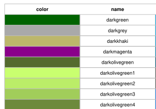
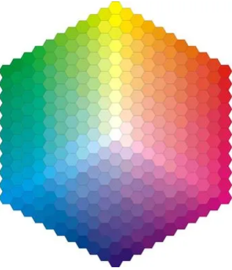
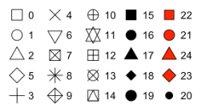
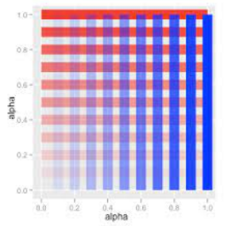

layout: true
class: animated, fadeIn


```{r setup, include=FALSE}
options(htmltools.dir.version = FALSE, htmltools.preserve.raw = FALSE)
library(xaringan)
```

```{r xaringan-themer, include=FALSE, warning=FALSE}
library(xaringanthemer)
style_mono_accent(base_color = "#00746B", 
                  colors = c(red = "#f34213",
                             blue = '#0000ff',
                             purple = "#3e2f5b",
                             orange = "#ff8811",
                             green = "#1d771d",
                             white = "#FFFFFF"))
```

```{css, echo=F}
.code {
  color: #777;
  width: 48%;
  height: 92%;
  float: left;
}
.plot {
  width: 50%;
  height: 70%;
  float: right;
  padding-left: 1%;
}
```

---
class: inverse, hide-logo, center, middle

.font180[
“Un simple gráfico ha brindado más información a la mente del analista de datos que cualquier otro dispositivo”. — *John Tukey*
]
---
## Objetivos de la visualización
<br>
<br>
<br>
.font160[


- **Análisis exploratorio**: descubrir y describir patrones en los datos (parte del Análisis Exploratorio de Datos - EDA)

- **Presentación y comunicación**: capacidad de transmitir el mensaje de forma clara y atractiva. 
]
---
background-image: url(assets/signos.png) 
background-size: 850px
background-position: 50% 75%
## Señales visuales
---
## Gramática de gráficos

.code[.font140[
De manera similar a la gramática lingüística, *"La gramática de gráficos"* define un conjunto de reglas para construir gráficos estadísticos combinando diferentes tipos de capas. 

Esta gramática fue creada por **Leland Wilkinson** (*2005, The Grammar of Graphics (Statistics and Computing). Secaucus, NJ, USA: Springer-Verlag New York, Inc.*)
]]

.plot[
```{r, echo=F}
knitr::include_graphics("assets/layers.PNG")
```

]
---
background-image: url(assets/ggplot2_exploration_es.png) 
background-size: 650px
background-position: 50% 40%

.footnote[[Artwork by @allison_horst](https://twitter.com/allison_horst)]
---

class: left

background-image: url(assets/ggplot2.PNG), url(assets/str_ggplot2.PNG), url(assets/sistema_ggplot2.PNG)
background-size: 160px, 600px, 400px
background-position: 50% 5%, 50% 65%, 50% 95%
<br>
<br>
<br>
<br>
<br>
<br>
.font140[
**ggplot2** es un paquete que se autodefine como librería para _**“crear elegantes visualizaciones de datos usando una gramática de gráficos”**_

El paquete propone un sistema que se basa en la idea que cualquier gráfico se puede construir usando tres componentes básicos:
]
---
## Esquema gráfico ggplot2 
<br>
.font150[
- **Datos** con estructura "ordenada"

]
---
## Esquema gráfico ggplot2 
<br>
.font150[
- **Datos** con estructura "ordenada"

- Mapeo estético (**aes**thetic) de los datos


]
---
## Esquema gráfico ggplot2 
<br>
.font150[
- **Datos** con estructura "ordenada"

- Mapeo estético (**aes**thetic) de los datos

- Objetos **geom**étricos que dan nombre al tipo de gráfico


]
---
## Esquema gráfico ggplot2 
<br>
.font150[
- **Datos** con estructura "ordenada"

- Mapeo estético (**aes**thetic) de los datos

- Objetos **geom**étricos que dan nombre al tipo de gráfico

- **Coord**enadas que organizan los objetos geométricos


]
---
## Esquema gráfico ggplot2 
<br>
.font150[
- **Datos** con estructura "ordenada"

- Mapeo estético (**aes**thetic) de los datos

- Objetos **geom**étricos que dan nombre al tipo de gráfico

- **Coord**enadas que organizan los objetos geométricos

- Escalas (**scale**) definen el rango de valores de las estéticas

]
---
## Esquema gráfico ggplot2 
<br>
.font150[
- **Datos** con estructura "ordenada"

- Mapeo estético (**aes**thetic) de los datos

- Objetos **geom**étricos que dan nombre al tipo de gráfico

- **Coord**enadas que organizan los objetos geométricos

- Escalas (**scale**) definen el rango de valores de las estéticas

- **Facet**as que agrupan en subgráficos
]
---
background-image: url(assets/geoms.png) 
background-size: 900px
background-position: 50% 65%
## Las geometrias definen el tipo de gráfico

---
## El esquema básico de un gráfico
<br>
.font150[ 
.bg-green[
```{r, eval=FALSE}
<DATOS> |>  
  ggplot(mapping = aes(<MAPEO>)) +
  <GEOM_FUNCION>()
```
]]

.font150[
Las capas posteriores son opcionales. Algunas de ellas son:
]

.font150[
```{r, eval=FALSE}
[dataframe] |>  
  ggplot(mapping = aes(x = [x-varible],
                       y = [y-variable])) +
  geom_xxx() +
  scale_x_...() +
  scale_y_...() +
  scale_fill_...() +
  otras capas más
```
]
---
background-image: url(assets/pingui.PNG)
background-size: 200px
background-position: 90% 70%

## Construcción de un gráfico paso a paso

.font140[
En estas diapositivas vamos a utilizar unos datos de ejemplo que vienen incorporados en el dataset `pinguinos` del paquete **datos**.
]

```{r, warning=F, message=F}
library(tidyverse)
library(datos)

glimpse(pinguinos)
```


---
## Coordenadas base

.code[.font140[
```{r, eval=F}
pinguinos |> 
  ggplot(aes(x=alto_pico_mm, 
             y = largo_pico_mm))
```
]
]

.plot[
```{r, echo=F, warning=FALSE, fig.retina=3}
pinguinos |> 
  ggplot(aes(x=alto_pico_mm, y = largo_pico_mm))
```

]

---
## Geometría

.code[.font130[
```{r, eval=F}
pinguinos |> 
  ggplot(aes(x=alto_pico_mm, 
             y = largo_pico_mm)) +
  geom_point() #<<
```
]
]

.plot[
```{r, echo=F, warning=FALSE, fig.retina=3}
pinguinos |> 
  ggplot(aes(x=alto_pico_mm, 
             y = largo_pico_mm)) +
  geom_point()
```

]
---
## Propiedades visuales de la capa geométrica


.code[.font130[
Seteamos propiedades de los puntos.
```{r, eval=F}
pinguinos |> 
  ggplot(aes(x=alto_pico_mm, 
             y = largo_pico_mm)) +
  geom_point(color = "blue", #<<
             shape = 17,     #<<
             size = 3,       #<<
             alpha = 0.5)    #<<
```
]]


.plot[
```{r, echo=F, warning=F, fig.retina=3}

pinguinos |> 
  ggplot(aes(x=alto_pico_mm, y = largo_pico_mm)) +
  geom_point(color = "blue",
             shape = 17, 
             size = 3,
             alpha = 0.5)
```
]
---
## Colores

.font140[
Se puede usar colores bajo el argumento **color** para geometrías de puntos, líneas y contornos y **fill** para rellenos de polígonos.

El lenguaje maneja una serie de colores numerados y bajo 657 nombres reservados en la función `colors()`. También permite incorporar valores hexadecimales de la paleta (16.777.216 colores posibles).
]

.code[
```{r,echo=F,  fig.align='center', out.width = "60%"}

```
]

.plot[
```{r,echo=F,  fig.align='center', out.width = "40%"}

```
]
---
## Forma

.font140[
En el caso del elemento geométrico punto hay disponibles una serie de formas (**shape**) bajo estos código numéricos.
]

```{r,echo=F,  fig.align='center', out.width = "40%"}

```

---
## Tamaño y transparencia

.font140[
Las otras dos propiedades visuales son el tamaño del punto (**size**) y la transparencia u opacidad (según desde donde se lo mire) llamada **alpha**. 

Esta propiedad tiene valores de 0 a 1, 0 es todo transparente (no se visualiza) y 1 es todo opaco (no tiene transparencia)
]
```{r,echo=F,  fig.align='center', out.width = "25%"}

```
---
## Mapeo de propiedades visuales

.code[.font130[
Mapeamos variable `especie` a color. 
```{r, eval=F}
pinguinos |> 
  ggplot(aes(x=alto_pico_mm, 
             y = largo_pico_mm,
             color = especie)) +  #<<
  geom_point()
```
]
]

.plot[
```{r, echo=F, warning=F, fig.retina=3}
pinguinos |> 
  ggplot(aes(x=alto_pico_mm, 
             y = largo_pico_mm,
             color = especie)) +
  geom_point()
```
]
---
## Mapeando condiciones

.code[.font130[
Mapeamos en color la condición `alto_pico_mm > 19`.
```{r, eval=F}
pinguinos |> 
  filter(!is.na(alto_pico_mm)) |> 
  ggplot(aes(x=alto_pico_mm, 
             y = largo_pico_mm,
             color = alto_pico_mm > 19)) +  #<<
  geom_point()
```
]
]

.plot[
```{r, echo=F, warning=F, fig.retina=3}
pinguinos |> 
  filter(!is.na(alto_pico_mm)) |> 
  ggplot(aes(x=alto_pico_mm, 
             y = largo_pico_mm,
             color = alto_pico_mm > 19)) +
  geom_point()
```
]

---
## Agregando variables a otras propiedades visuales

.code[.font130[
Mapeamos `isla` con forma (shape)
```{r, eval=F}
pinguinos |> 
  ggplot(aes(x=alto_pico_mm, 
             y = largo_pico_mm,
             color = especie,
             shape = isla)) + #<<
  geom_point()
```
]
]

.plot[
```{r, echo=F, warning=F, fig.retina=3}
pinguinos |> 
  ggplot(aes(x=alto_pico_mm, 
             y = largo_pico_mm,
             color = especie,
             shape = isla)) + 
  geom_point()
```
]
---
## Agregando variables a otras propiedades visuales

.code[.font130[
Mapeamos `masa_corporal_g` con tamaño (size).
```{r, eval=F}
pinguinos |> 
  ggplot(aes(x=alto_pico_mm, 
             y = largo_pico_mm,
             color = especie,
             shape = isla,
             size = masa_corporal_g)) + #<<
  geom_point()
```
]
]

.plot[
```{r, echo=F, warning=F, fig.retina=3}
pinguinos |> 
  ggplot(aes(x=alto_pico_mm, 
             y = largo_pico_mm,
             color = especie,
             shape = isla,
             size = masa_corporal_g)) + 
  geom_point()
```
]
---
## Agregando capas geométricas

.code[.font130[
Volvemos a una versión del gráfico más básica y agregamos otra capa geométrica.
```{r, eval=F}
pinguinos |> 
  ggplot(aes(x=alto_pico_mm, 
             y = largo_pico_mm,
             color = especie)) + 
  geom_point() + 
  geom_smooth(method = "lm") #<<
```
]
]

.plot[
```{r, echo=F, warning=F, fig.retina=3, message=FALSE}
pinguinos |> 
  ggplot(aes(x=alto_pico_mm, 
             y = largo_pico_mm,
             color = especie)) + 
  geom_point() + 
  geom_smooth(method = "lm")
```
]

---
## Mapeo global vs local

.code[.font130[
El gráfico anterior mapea la variable **especie** en color de manera *global*. Ahora lo hacemos *localmente* solo en `geom_point()`.
```{r, eval=F}
pinguinos |> 
  ggplot(aes(x=alto_pico_mm, 
             y = largo_pico_mm)) + 
  geom_point(aes(color = especie)) + #<<
  geom_smooth(method = "lm") 
```
]
]

.plot[
```{r, echo=F, warning=F, fig.retina=3, message=FALSE}
pinguinos |> 
  ggplot(aes(x=alto_pico_mm, 
             y = largo_pico_mm)) + 
  geom_point(aes(color = especie)) + 
  geom_smooth(method = "lm") 
```
]
---
## Escalas de eje

.code[.font130[
Hay escalas para varios elementos del gráfico. Uno de ellos son los ejes. Acá modificamos el eje x.
```{r, eval=F}
pinguinos |> 
  ggplot(aes(x=alto_pico_mm, 
             y = largo_pico_mm,
             color = especie)) + 
  geom_point() +
  scale_x_continuous(name = "Alto del pico (mm)",   #<<
                     limits = c(12,23),             #<<
                     breaks = seq(12, 23, by = 1))  #<<
```
]
]

.plot[
```{r, echo=F, warning=F, fig.retina=3, message=FALSE}
pinguinos |> 
  ggplot(aes(x=alto_pico_mm, 
             y = largo_pico_mm,
             color = especie)) + 
  geom_point() +
  scale_x_continuous(name = "Alto del pico (mm)", 
                     limits = c(12,23),               
                     breaks = seq(12, 23, by = 1))
```
]
---
## Escalas de colores

.code[.font130[
Modificamos la escala de colores para los puntos, incorporando valores manuales.
```{r, eval=F}
pinguinos |> 
  ggplot(aes(x=alto_pico_mm, 
             y = largo_pico_mm,
             color = especie)) + 
  geom_point() +
  scale_color_manual(values = c("darkorange", #<<
                                "darkorchid",#<<
                                "cyan4"))  #<<
                     
```
]
]

.plot[
```{r, echo=F, warning=F, fig.retina=3, message=FALSE}
pinguinos |> 
  ggplot(aes(x=alto_pico_mm, 
             y = largo_pico_mm,
             color = especie)) + 
  geom_point() +
  scale_color_manual(values = c("darkorange","darkorchid","cyan4"))
```
]
---
## Leyenda


.code[.font130[
La leyenda se puede mostrar en diferentes partes o no hacerlo. Aquí lo hacemos debajo del gráfico.
```{r, eval=F}
pinguinos |> 
  ggplot(aes(x=alto_pico_mm, 
             y = largo_pico_mm,
             color = especie)) + 
  geom_point() +
  theme(legend.position = "bottom")  #<<
```
]
]

.plot[
```{r, echo=F, warning=F, fig.retina=3, message=FALSE}
pinguinos |> 
  ggplot(aes(x=alto_pico_mm, 
             y = largo_pico_mm,
             color = especie)) + 
  geom_point() +
  theme(legend.position = "bottom")
```
]
---
## Agregamos etiquetas

.code[.font130[
Agregamos etiquetas a los ejes, titulo, etc.
```{r, eval=F}
pinguinos |> 
  ggplot(aes(x=alto_pico_mm, 
             y = largo_pico_mm,
             color = especie)) + 
  geom_point() +
  labs(x = "Alto del pico (mm)",   #<<
       y = "Largo del pico (mm)",  #<<
       title = "Relación entre alto y largo de los picos", #<<
       subtitle = "Dimensiones para pinguinos Adelie, Chinstrap y Gentoo",                                    #<<
       caption = "Fuente: Dataset pinguinos")  #<<
```
]
]

.plot[
```{r, echo=F, warning=F, fig.retina=3, message=FALSE}
pinguinos |> 
  ggplot(aes(x=alto_pico_mm, 
             y = largo_pico_mm,
             color = especie)) + 
  geom_point() +
    labs(x = "Alto del pico (mm)",   
       y = "Largo del pico (mm)",  
       title = "Relación entre alto y largo de los picos", 
       subtitle = "Dimensiones para pinguinos Adelie, Chinstrap y Gentoo",                                    
       caption = "Fuente: Dataset pinguinos") 
```
]

---
## Cambiamos temas

.code[.font130[
Cambiamos el tema estético del fondo del gráfico.
```{r, eval=F}
pinguinos |> 
  ggplot(aes(x=alto_pico_mm, 
             y = largo_pico_mm,
             color = especie)) + 
  geom_point() +
  theme_bw()  #<<
```
]
]

.plot[
```{r, echo=F, warning=F, fig.retina=3, message=FALSE}
pinguinos |> 
  ggplot(aes(x=alto_pico_mm, 
             y = largo_pico_mm,
             color = especie)) + 
  geom_point() +
  theme_bw()
```
]

---
## Facetas

.code[.font130[
Facetamos usando una variable (`sexo`)
```{r, eval=F}
pinguinos |> 
  ggplot(aes(x=alto_pico_mm, 
             y = largo_pico_mm,
             color = especie)) + 
  geom_point() +
  facet_wrap(~sexo)  #<<
```
]
]

.plot[
```{r, echo=F, warning=F, fig.retina=3, message=FALSE}
pinguinos |> 
  filter(!is.na(sexo)) |> 
  ggplot(aes(x=alto_pico_mm, 
             y = largo_pico_mm,
             color = especie)) + 
  geom_point() +
  facet_wrap(~sexo)
```
]
---
## Facetas

.code[.font130[
Facetamos usando dos variables (`sexo` e `isla`)
```{r, eval=F}
pinguinos |> 
  ggplot(aes(x=alto_pico_mm, 
             y = largo_pico_mm,
             color = especie)) + 
  geom_point() +
  facet_grid(isla ~ sexo)  #<<
```
]
]

.plot[
```{r, echo=F, warning=F, fig.retina=3, message=FALSE}
pinguinos |> 
  filter(!is.na(sexo)) |> 
  ggplot(aes(x=alto_pico_mm, 
             y = largo_pico_mm,
             color = especie)) + 
  geom_point() +
  facet_grid(isla ~ sexo)
```
]
---
background-image: url(assets/ggplot2_obra_maestra.png) 
background-size: 700px
background-position: 50% 40%

.footnote[[Artwork by @allison_horst](https://twitter.com/allison_horst)]
---
### Exportar gráficos de ggplot2

.font120[ 
- Desde el **_panel Plot_** de .bold[RStudio]

- En formatos conocidos como JPG, PNG, PDF, etc

- Mayor control con la función **_ggsave()_**

```{r, eval=FALSE}
ggsave(filename,               # nombre del archivo
  plot = last_plot(),          # nombre del objeto gráfico
  device = NULL,               # formato de salida "jpeg", "png", "tiff", "pdf", etc
  width = NA,                  # ancho en unidades de units
  height = NA,                 # alto en unidades de units
  units = c("in", "cm", "mm"), # unidades de medidas
  dpi = 300)                   # resolución de salida en dpi
```
]