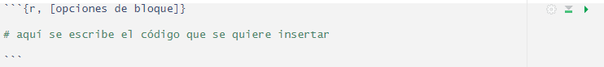
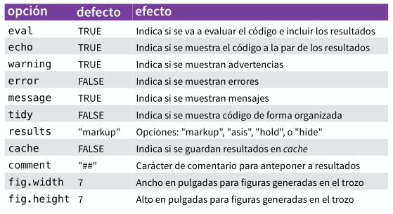

layout: true
class: animated, fadeIn


```{r setup, include=FALSE}
options(htmltools.dir.version = FALSE, htmltools.preserve.raw = FALSE)
library(xaringan)
```

```{r xaringan-themer, include=FALSE, warning=FALSE}
library(xaringanthemer)
style_mono_accent(base_color = "#00746B", 
                  colors = c(red = "#f34213",
                             blue = '#0000ff',
                             purple = "#3e2f5b",
                             orange = "#ff8811",
                             green = "#1d771d",
                             white = "#FFFFFF"))
```

```{css, echo=F}
.code {
  color: #777;
  width: 48%;
  height: 92%;
  float: left;
}
.plot {
  width: 50%;
  height: 70%;
  float: right;
  padding-left: 1%;
}
```

---
class: left
background-image: url(assets/esquema_comunicar.PNG)
background-size: 850px
background-position: 50% 60%

## Comunicar como parte del proceso del análisis

---
class: left
background-image: url(assets/Captura2.PNG)
background-size: 700px
background-position: 50% 60%

## Productos de RStudio

---
## Programación literaria o literal (Literate Programming)

.font140[
- La idea original proviene del experto en computación *Donald Knuth*

- Un artículo es un flujo de texto y código

- El código del análisis se divide en texto y porciones de código “chunks”

- El código de la presentación da formato a los resultados (tablas, figuras, etc)

- El texto del artículo explica lo que está sucediendo en el análisis

- Los programas literarios se *tejen* para producir documentos legibles 

En definitiva, la programación literaria mezcla:

- Un lenguaje de **documentación**
- Un lenguaje de **programación**
]

---
background-image: url(assets/Captura5.PNG) 
background-size: 750px
background-position: 50% 50%

## Flujo de trabajo
---

class: left

## Markdown

.font150[
**Markdown** es un lenguaje de marcas ligero que trata de conseguir la máxima legibilidad y *“publicabilidad”* .

Se ubica en el grupo de los lenguajes de marcas como **HTML**, **XML**, entre otros, aunque es mucho más sencillo de utilizar.

Viene soportado por RStudio, tanto para sus *Notebooks* como para documentos **R Markdown** y *presentaciones* (slides)

Luego se conecta con el convertidor de documentos universal **Pandoc** (http://pandoc.org/) para transformarse en formatos html (web), pdf o Word. 
]

---
background-image: url(assets/Captura6.PNG) 
background-size: 400px
background-position: 80% 50%

## YAML

.code[.font140[
RStudio incorpora un encabezado construido en **lenguaje YAML** en los archivos R Markdown para indicarle a Pandoc que tipo de documento queremos construir.

Un encabezado YAML es un conjunto de pares clave:valor al comienzo del archivo. Siempre comienza y termina con tres rayas (- - -)

YAML es la sigla de **“yet another markup language”** y es un lenguaje de estructuración de datos sencillo.

]]

---
background-image: url(assets/Captura7.PNG) 
background-size: 600px
background-position: 50% 80%

## knitr

.font150[
**knitr** es una herramienta para la generación de informes dinámico en R (integrada en Rstudio). 

Es un paquete de R (disponible en CRAN) que permite integrar código y sus salidas en documentos **Latex** y **HTML**, entre otros formatos conocidos.

El propósito de knitr es dar espacio a la reproducibilidad de investigación en R a través de Programación Literaria (código, salida y documentación en la misma salida)

]

---
## Incluyendo código (chunk)

.font140[
Los bloques de código se agregan dentro del documento de texto Rmarkdown mediante *"fragmentos"* (**chunk**) a partir de insertar (Ctrl+Alt+I) un bloque similar al siguiente:

<br>

```{r,echo=F,  out.width = "90%"}

```

Cuando se renderice el archivo *.Rmd*, R Markdown ejecutará cada fragmento de código e incrustará los resultados debajo del fragmento de código en su documento final.

]

---
## Algunas opciones de bloque


```{r,echo=F, fig.align='center', out.width = "70%"}

```


---
## Elementos que se pueden integrar

.font140[
- Lenguaje hmtl o latex (dependiendo la salida final)
- Tablas con estilos diferentes 
- Figuras importadas (archivos jpg o png)
- Formatos con estilos predefinidos (mediante plantillas – paquetes como *rticules* por ejemplo.)
- Citas bibliográficas
- Índices (marcadores para PDF’s)

Resultados de fragmentos de código R

- Resultados entre líneas de texto
- Tablas con **flextable**
- Resúmenes con **gtsummary**
- Gráficos estáticos con ggplot
- Gráficos interactivos (en formato Html)
]

---
## Estructura de un documento

.font150[
Un documento contiene *contenido*, *estructura*, *apariencia* y *formato*.

- **Contenido**: texto, código, gráficos. 

- **Estructura**: párrafos, listas, énfasis, etc. 

- **Apariencia**: fuentes, colores, diseño. 

- **Formato**: funcionalidad (estático, interactivo, diapositivas, etc)
]

---
## Formato Word con plantilla

.font140[
Una manera de controlar los elementos de un documento es mediante el uso de plantillas editadas de **Word**.

- Usamos *R Markdown* para crear un documento Word

- Editamos el estilo de Word

- Guardamos el documento como archivo de referencia de estilo

- Formateamos el documento Rmd utilizando ese archivo de referencia
]

---
## Estilo de Word

.font140[
Esto nos va a permitir modificar la estructura y apariencia de nuestro documento, modificando, entre otras cosas:

- Formato
  - Tamaño de la hoja 
  - Márgenes
- Diseño de cada elemento del documento:
  - Fuente
  - Tamaño 
  - Color
- Encabezado y pie de página
  - Numeración
  - Logotipos
]

---
## Modificación del encabezado YAML

.font140[

Para tomar como referencia el archivo Word modificado en su estilo se incorpora dentro de la cabecera YAML del Rmarkdown un argumento `reference_docx` de la siguiente forma:

```{r, eval=F}
---
title: "Mi documento"
author: "Mi nombre"
date: "27/11/2023"
output:
  word_document:
    reference_docx: word-referencia-estilo-01.docx
---

El documento comienza aquí
```

]

---
## Quarto

.font150[
*Quarto* unifica la funcionalidad de muchos paquetes del *ecosistema R Markdown* (rmarkdown, bookdown, distill, xaringan, etc.) en un único sistema y lo amplía con soporte nativo para múltiples lenguajes de programación como Python y Julia, además de R.

- el software se descarga de [quarto.org](https://quarto.org/)

- lanzado en el año 2022 como un nuevo sistema de publicación científica y técnica de código abierto

- los archivos *Quarto* son archivos de texto plano con extensión **.qmd**

- el funcionamiento es similar al R markdown, con cabeceras YAML y renderizado por knitr.

]

---
## Diferencias entre Quarto y rmarkdown

.font150[
- R Markdown requiere de R. Quarto es independiente.

- El ecosistema de paquetes R se reemplaza por un marco de trabajo único al que se puede acceder desde otros lenguajes.
]
---
## Qué se puede hacer con Quarto que no se pueda con R Markdown?

.font150[
Aunque utilizar ambos formatos son similares, con **Quarto** se puede:

- Organizar más fácilmente la apariencia de todos los documentos 

- Elementos como por ejemplo, figuras y tablas son más compatibles con varios formatos. 

- Mejores referencias cruzadas (artículos científicos)

- Diapositivas revealjs actualizadas 

- Es más fácil personalizar sitios web y libros con proyectos.
]