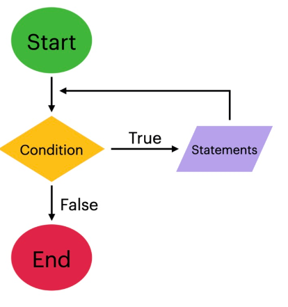

layout: true
class: animated, fadeIn


```{r setup, include=FALSE}
options(htmltools.dir.version = FALSE, htmltools.preserve.raw = FALSE)
library(xaringan)
```

```{r xaringan-themer, include=FALSE, warning=FALSE}
library(xaringanthemer)
style_mono_accent(base_color = "#00746B", 
                  colors = c(red = "#f34213",
                             blue = '#0000ff',
                             purple = "#3e2f5b",
                             orange = "#ff8811",
                             green = "#1d771d",
                             white = "#FFFFFF"))
```

```{css, echo=F}
.code {
  color: #777;
  width: 48%;
  height: 92%;
  float: left;
}
.plot {
  width: 50%;
  height: 70%;
  float: right;
  padding-left: 1%;
}
```

---
## Control del flujo de ejecución

.font150[
El flujo de ejecución del lenguage R es secuencial, es decir, las líneas de código corren una debajo de la otra.

Las estructuras de control de flujo son utilizadas en programación para modificar el flujo de ejecución secuencial de estas líneas de código y producir bucles o bifurcaciones a partir de condiciones.

Estas estructuras están presentes en todos los lenguajes de programación, lo que varía entre ellos es su sintaxis.

El lenguaje R como tal, trae incorporadas estas funciones en su base.

]

---
## Bucles

.font160[
Los bucles (o *“loops"* en inglés) son estructuras especiales que sirven para ejecutar una tarea una cantidad arbitraria de veces.

A cada una de estas repeticiones se la denomina **iteración**. 

En definitiva, sirven para hacer en forma automática un proceso que llevaría escribir muchas más líneas de código.

Los comandos más comunes y universales para hacer bucles en programación son las funciones **for** y **while**.

]
---
## Función for()

.pull-left[.font150[
Usamos la función **for()** cuando es necesario repetir la ejecución de un mismo grupo de instrucciones una cantidad de determinada de veces.

La cantidad de iteraciones suele definirse a partir de recorrer la longitud de un objeto (*por ejemplo, el número de observaciones de un dataframe o el número de elementos de un vector*)
]]

.pull-right[
```{r,echo=F,  fig.align='center', out.width = "80%"}
knitr::include_graphics("assets/for.PNG")
```
]

---
## Función while()

.pull-left[.font150[
Como su nombre en inglés lo indica, **while()** (*mientras*) es un bucle que se ejecutará solamente mientras la o las condiciones especificadas se cumplan, interrumpiéndose inmediatamente cuando dejen de hacerlo.

Es decir, es un bucle manejado por una condición lógica.

]]

.pull-right[
```{r,echo=F,  fig.align='center', out.width = "80%"}

```
]
---
## Bucle repeat - break

.font150[
Existe otra estructura tipo bucle, poco utilizada por considerarse peligrosa, cuya función es **repeat()**.

Es la más simple de todas:  se limita a repetir funciones hasta que el usuario de una orden de finalización. La  forma de determinar la finalización es usando **break()**.

Es peligrosa porque muchas veces las iteraciones pueden producirse infinitamente, dado que depende exclusivamente del usuario que controla el break() mediante código.
]

---
## Condicional if-else

.pull-left[.font150[
Es la estructura que permite que se bifurquen los caminos del flujo de ejecución en un script.

Consta de una condición que nos arroja uno de dos posibles resultados: Verdadero o Falso. En función de estos, se ejecutan las líneas de código para el Si o de lo contrario (**else**) para el No.

La diferencia con **if_else()** es que permite multiplicidad de líneas a ejecutar luego de la condición.
]]

.pull-right[
```{r,echo=F,  fig.align='center', out.width = "100%"}
knitr::include_graphics("assets/if_else.PNG")
```
]


