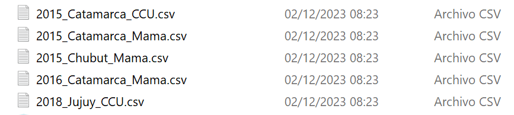
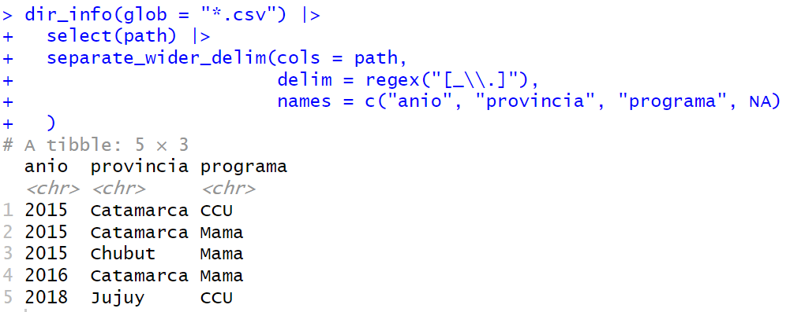
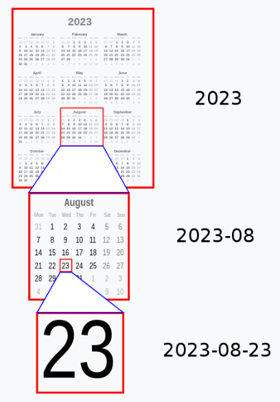
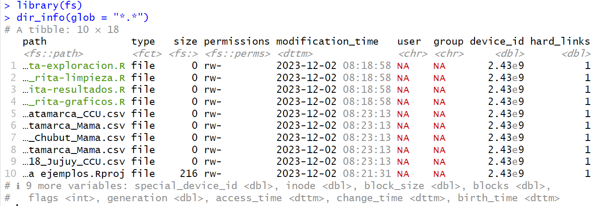

layout: true
class: animated, fadeIn


```{r setup, include=FALSE}
options(htmltools.dir.version = FALSE, htmltools.preserve.raw = FALSE)
library(xaringan)
```

```{r xaringan-themer, include=FALSE, warning=FALSE}
library(xaringanthemer)
style_mono_accent(base_color = "#00746B", 
                  colors = c(red = "#f34213",
                             blue = '#0000ff',
                             purple = "#3e2f5b",
                             orange = "#ff8811",
                             green = "#1d771d",
                             white = "#FFFFFF"))
```

```{css, echo=F}
.code {
  color: #777;
  width: 48%;
  height: 92%;
  float: left;
}
.plot {
  width: 50%;
  height: 70%;
  float: right;
  padding-left: 1%;
}
```

---
class: center, middle, inverse, hide-logo

# Elige una convención para nombrar 

# archivos en tus proyectos
<br>

# Cualquier convención puede ser válida, 

# pero solo elige una

---
class: middle

.pull-left[
.font200[.center[.bold[
.red[MAL]
]]]

.font140[
miresumen.docx

Tabla con poblacion del INDEC.xlsx

figura 1.png

script con explicaciones version 3.R
]]

.pull-right[
.font200[.center[.bold[
.green[BIEN]
]]]

.font140[
2023-12-04_resumen-para-IARC.docx

tabla-poblacion-indec.xlsx

fig01_barras-grupo_etario.png

3_version_con_explicaciones.R
]]

---
class: middle, inverse, hide-logo

#Los mejores nombres de archivos son... 
<br>
##- entendibles para las computadoras

##- entendibles para los humanos

##- ordenados de manera útil

---
class: center, middle

# Es conveniente adaptar la convención de nombres de tus archivos en función de la manera en que vas a interactuar con ellos desde R
---
class: inverse, hide-logo

## Entendibles para las computadoras

.font180[
- Que a la estructura de los nombres se le pueda aplicar expresiones regulares y/o captura de conjuntos: 
  - evite espacios,
  - puntuación, 
  - caracteres acentuados y 
  - distinción entre mayúsculas y minúsculas. 

- Fácil de manipular: uso deliberado de delimitadores.
]
---
## Expresiones regulares

```{r,echo=F,  fig.align='center', out.width = "70%"}

```


```{r,echo=F,  fig.align='center', out.width = "70%"}

```

---
# Entendibles para los humanos

.font160[Esto es hacer que sea fácil adivinar qué contiene el archivo a partir de su nombre.

Por ejemplo:

.pull-left[
Mejor que: 

`1_rita.R`

`02.R`

`auxiliar.R`
]

.pull-right[
es

`01_rita-exploracion.R`

`02_rita-limpieza.R`

`08_rita_codigo_auxiliar.R`
]


]
---
class: inverse, hide-logo

# Ordenado de una manera útil

## - piense y planifique la clasificación alfanumérica 

## - escriba algo numérico primero para "ordenar"

## - use el estándar ISO 8601 para las fechas

## - complete los números con ceros a la izquierda

---
## ISO 8601

```{r,echo=F,  fig.align='center', out.width = "30%"}

```

---
## Numeración correcta

.pull-left[
.font200[.center[.bold[
.red[MAL]
]]]

.font160[
10_figs-final-para-publicar.R

1_depuracion-datos.R

2_modelos-ajustados.R
]]

.pull-right[
.font200[.center[.bold[
.green[BIEN]
]]]

.font160[
01_depuracion-datos.R

02_modelos-ajustados.R

10_figs-final-para-publicar.R

]]

---
## Paquete fs

.font150[
Este paquete aporta una interfaz uniforme y multiplataforma para las operaciones del sistema de archivos.

Las funciones de **fs** son compatibles con el ecosistema tidyverse, trabaja con rutas y archivos "ordenados" y adopta el encoding UTF-8.

Según como comiencen, las funciones principales se dividen en:

- `path_` para manipular y crear rutas
- `file_` para archivos
- `dir_` para directorios (carpetas)
]

---
## Ejemplo dir_info()

<br>

```{r,echo=F,  fig.align='center', out.width = "100%"}

```
