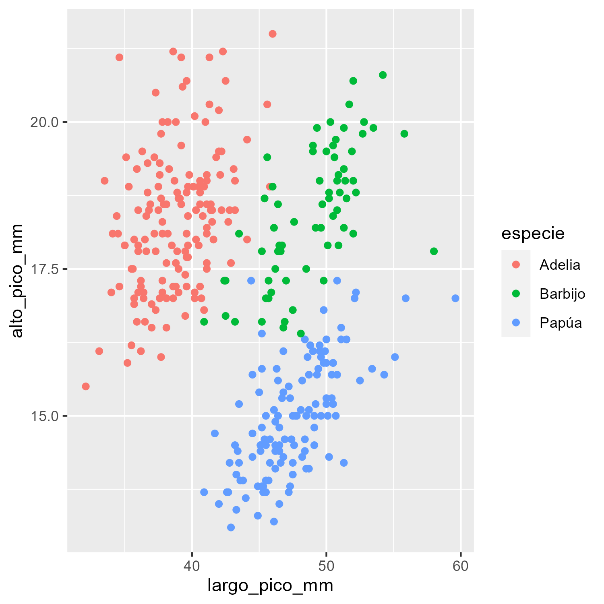
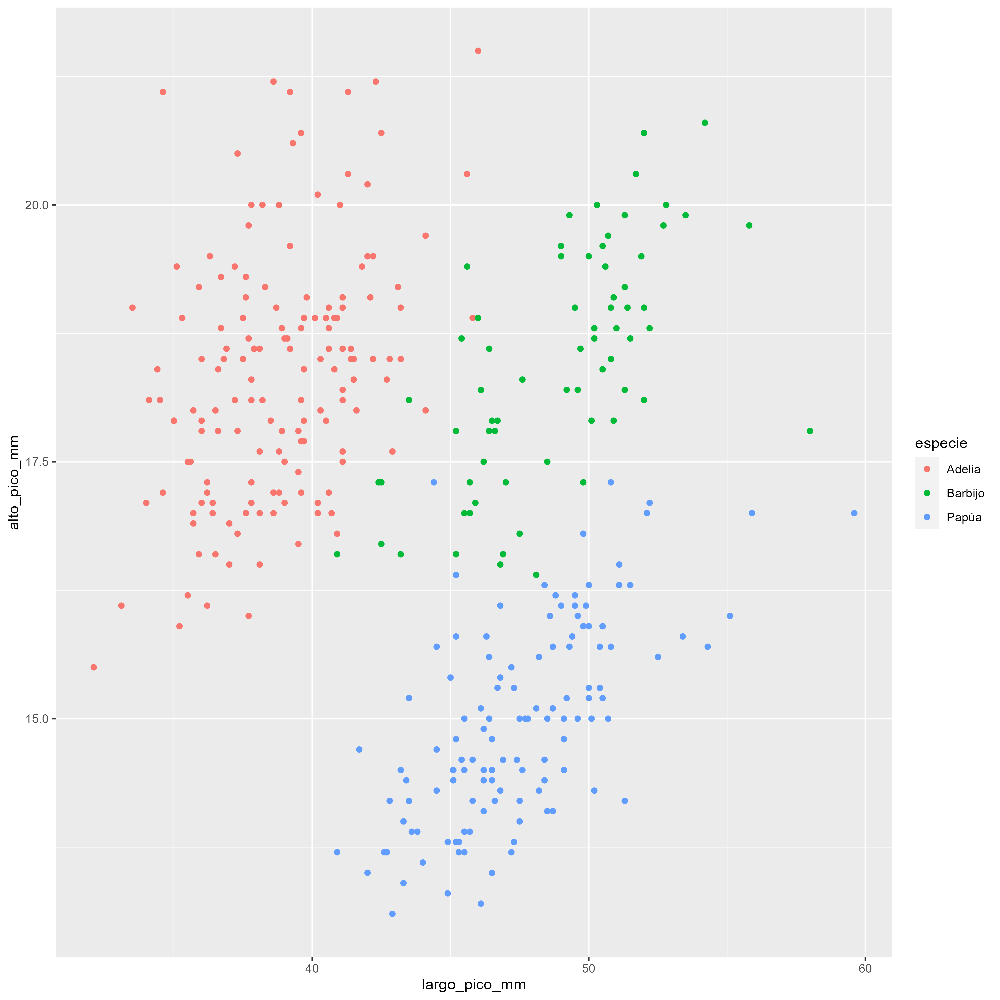

layout: true
class: animated, fadeIn


```{r setup, include=FALSE}
options(htmltools.dir.version = FALSE, htmltools.preserve.raw = FALSE)
library(xaringan)
```

```{r xaringan-themer, include=FALSE, warning=FALSE}
library(xaringanthemer)
style_mono_accent(base_color = "#00746B", 
                  colors = c(red = "#f34213",
                             blue = '#0000ff',
                             purple = "#3e2f5b",
                             orange = "#ff8811",
                             green = "#1d771d",
                             white = "#FFFFFF"))
```

```{css, echo=F}
.code {
  color: #777;
  width: 48%;
  height: 92%;
  float: left;
}
.plot {
  width: 50%;
  height: 70%;
  float: right;
  padding-left: 1%;
}
```

---
## ¿Qué tiene de complicado el tamaño y la resolución?

.font160[
Muchas veces nos encontramos con la situación de crear un gráfico que se ve bien en el panel *Plot* de **RStudio** y cuando lo exportamos el tamaño de sus partes (textos, leyendas, etc) se achican o agrandan de tal forma que el producto final es feo y/o desproporcionado.

La respuesta a estos problemas tienen que ver con dos conceptos que debemos entender y poder controlar: el **tamaño** y la **resolución**.
]

---
## Pantalla

.font150[
Repasemos algunos conceptos de imagen en pantalla:

La pantalla es una matriz de **pixeles**. Todas las imagenes que vemos en ella estan compuesta por ellos.

La que estoy utilizando ahora tiene una **dimensión** de 24 pulgadas con un ratio de aspecto 16/10 (20 x 12,5 pulgadas)

La **resolución** es de 1920 x 1200, es decir tiene 1920 píxeles de ancho y 1200 píxeles de alto.

El número de píxeles por pulgada es de 96 (**dpi**).
]

---
## Pantalla

.font160[
Hagamos algunos calculos para ver si todo está en orden:

- **ancho**: 1920 (px)  /  96 (px/in) = 20 pulgadas

- **alto**: 1200 (px)  /  96 (px/in) = 12,5 pulgadas

- **relación**: 1920 / 1200 = 20 / 12,5 =  16/10
]

---
## Archivos de imagen

.font150[
Las imágenes que se crean con **ggplot2**, por ejemplo, están constituidas por pixeles. 

En las imágenes también se relacionan las dimensiones y las resoluciones.

Para pasar de la dimensión en pulgadas a una cantidad de puntos **ggsave()** utiliza la cantidad de puntos por pulgadas (dpi).

Si creamos un gráfico de 12 x 10 pulgadas a 300 dpi, el archivo será una matriz de (12 \* 300) x (10 \* 300) = 3600 x 3000 puntos.

Cuando abrimos el archivo en nuestra computadora, cada punto representa un pixel, lo que da una imagen de 3600 x 3000 px de resolución.
]

---
## Experimento práctico

.font150[
Hagamos un pequeño experimento con un gráfico sencillo basado en los pinguinos. 
]

.code[.font140[

```{r, eval=F}
library(tidyverse)
library(datos)

pinguinos %>%
    ggplot(aes(largo_pico_mm, 
               alto_pico_mm, 
               color = especie)) +
    geom_point()
```

]]

.plot[
```{r, echo=FALSE, message=FALSE, warning=FALSE, fig.height=5}
library(tidyverse)
library(datos)

pinguinos %>%
    ggplot(aes(largo_pico_mm, alto_pico_mm, color = especie)) +
    geom_point()
```
]

---
## Experimento práctico

.font140[
```{r, eval=F}
ggsave("prueba.png", width = 10, height = 5, dpi = 300)
```

Si calculamos, la salida se almacena como:

- **ancho**: 10 pulgadas * 300 dpi = 3000 px

- **alto**: 5 pulgadas * 300 dpi = 1500 px

Ahora si en lugar de guardar el gráfico solo lo visualizaramos en el monitor:

- **ancho**: 10 pulgadas * 96 dpi = 960 px

- **alto**: 5 pulgadas * 96 dpi = 480 px

]
---
## Experimento práctico

.font140[
La relación entre el tamaño de la pantalla y el tamaño físico depende del dpi (puntos por pulgada) del dispositivo gráfico, que es **96** por defecto para la pantalla. 

Luego, si guardamos el gráfico con un dpi mayor o menor, el archivo se guarda como una matriz de puntos usando el nuevo dpi y el tamaño en pulgadas. 

Entonces, cuando se abre en la computadora, la dimensión del tamaño en píxeles es diferente.

Si visualizamos un gráfico con muchos más pixeles que otro en el mismo espacio (nuestra pantalla) los elementos que lo componen se van a ver más pequeños.
]

---
class: middle, center, inverse, hide-logo

# ¿Por qué es importante esta diferencia?

.font160[
Importa porque algunos elementos del gráfico se ajustan al espacio disponible, y algunos son fijos y medidos en su dimensión real (cm, mm o pulgadas) como las fuentes de los textos, creando una distorsión al cambiar la dimensión del gráfico o su resolución.
]

---
## Problemas con fuentes

.font150[
Comparemos dos archivos exportados desde **ggplot2**:
]

.pull-left[
.font140[
*font_prueba1_5x5_300.png*
]
```{r,echo=F,  fig.align='center', out.width = "70%"}

```
]

.plot[
.font140[
*font_prueba1_10x10_300.png*
]
```{r,echo=F,  fig.align='center', out.width = "70%"}

```
]

---
## Problemas con fuentes

.font150[
Observamos que el tamaño del punto y la fuente parecen más pequeños en el gráfico de la derecha.

De hecho no son más pequeños, siguen teniendo el mismo tamaño en pulgadas, y como guardamos con la misma resolución (dpi = 300), tienen el mismo número de puntos (tamaño en pulgadas * 300). 

La fuente del gráfico aparece más pequeña porque el segundo gráfico es más grande (3000x3000 frente a 1500x1500) y se achica todo para que el gráfico entre en la pantalla.
]

---
## Soluciones a estos problemas 

.font150[
Hay 3 caminos posibles:

- Ajuste el tamaño de fuente cuando cambie el tamaño o la resolución del gráfico, pero si el gráfico es complejo, eso podría implicar muchas modificaciones.

- Establezca el tamaño del gráfico en pulgadas y la resolución al principio, y luego trabaje en la personalización.

- Utilice el paquete **ragg** que tiene un parámetro de escala para manejar los cambios de dimensión manteniendo las proporciones.
]
---
## Diferencia en tamaño de fuentes

.font150[
En la configuración de `theme()` el tamaño de las fuentes está definido en pts. (15 significa *15 puntos*). 

En la capa `geom_text()`, el tamaño se define en mm, por lo que 15 es *15 mm*.
]

### ¿Cuál es la relación entre pts y mm o in? 

.font150[
1 punto = 1/72 pulgadas

1 punto = 0,35 mm

]

---
## Diferencia en tamaño de fuentes

.font150[
Entonces si queremos que el texto tenga el mismo tamaño que el título, el tamaño en mm será 15 pt * 0,35 pt/mm = 5,25 mm

En **ggplot**, hay una constante definida para realizar la conversión, .pt = 2,845276. (1/.pt = 0,35). Podemos escribir .pt en la consola y mostrará su valor:

```{r}
ggplot2::.pt
```

Entonces para hacer la conversión:

de pt a mm :   mm = pt / .pt -> 15 / 2,845276 = 5,27

de mm a pt :   pt = mm * .pt -> 5,27 * 2,845276 = 15
]
---
## Diferencia en tamaño de fuentes

.pull-left[
```{r, eval=F}
pinguinos %>%
    ggplot(aes(x = largo_pico_mm, 
               y = alto_pico_mm, 
               color = especie)) +
  geom_point()+
  geom_text(x = 45, 
            y = 20, 
            label = "Ejemplo font 15", 
            size = 15, 
            inherit.aes = FALSE) +
  labs(title = "Relación entre largo y altura de picos por especies") +
  theme(plot.title = element_text(size = 15))
```
]

.plot[
```{r, echo=F, message=F, warning=F}
pinguinos %>%
    ggplot(aes(largo_pico_mm, alto_pico_mm, color = especie)) +
  geom_point()+
  geom_text(x = 45, y = 20, label = "Ejemplo font 15", size = 15, inherit.aes = FALSE) +
  labs(title = "Relación entre largo y altura de picos por especies") +
  theme(plot.title = element_text(size = 15))
```
]
---
## Diferencia en tamaño de fuentes

.pull-left[
```{r, eval=F}
pinguinos %>%
    ggplot(aes(x = largo_pico_mm, 
               y = alto_pico_mm, 
               color = especie)) +
  geom_point()+
  geom_text(x = 45, 
            y = 20, 
            label = "Ejemplo font 15", 
            size = 15/.pt, #<<
            inherit.aes = FALSE) +
  labs(title = "Relación entre largo y altura de picos por especies") +
  theme(plot.title = element_text(size = 15))
```
]

.plot[
```{r, echo=F, message=F, warning=F}
pinguinos %>%
    ggplot(aes(largo_pico_mm, alto_pico_mm, color = especie)) +
  geom_point()+
  geom_text(x = 45, y = 20, label = "Ejemplo font 15", size = 15/.pt, inherit.aes = FALSE) +
  labs(title = "Relación entre largo y altura de picos por especies") +
  theme(plot.title = element_text(size = 15))
```
]
---
## Paquete ragg

.font140[
Este paquete declara un espacio de exportación con `agg_*()` (por ejemplo para un archivo png), luego se ejecuta el código del gráfico, finalmente se cierra el espacio con `dev.off()`.

La función incorpora un argumento **scaling** que posibilita escalar los elementos como el texto adaptandose a variaciones en los tamaños de salida. 

.pull-left[
PNG de 10 x 10 pulgadas con resolucion de 300 dpi
```{r, eval=F}
ragg::agg_png("ragg_10x10.png", 
              width = 10, 
              height = 10, 
              units = "in", 
              res = 300)
```
]

.plot[
PNG de 20 x 20 pulgadas con resolucion de 300 dpi
```{r, eval=F}
ragg::agg_png("ragg_20x20.png", 
              width = 20, 
              height = 20, 
              units = "in", 
              res = 300,
              scaling = 2) #<<
```
]]